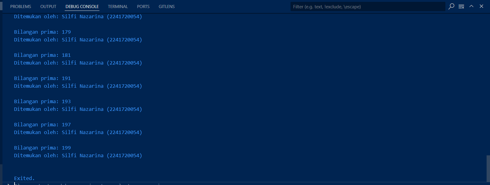

# PRAKTIKUM

## PRAKTIKUM 1

### Langkah 1

```dart
void main() {
  String test = "test2";
  
  if (test == "test1") {
    print("Test1");
  } else if (test == "test2") {
    print("Test2");
  } else {
    print("Something else");
  }

  if (test == "test2") print("Test2 again");
}
```

### Langkah 2

Silakan coba eksekusi (Run) kode pada langkah 1 tersebut. Apa yang terjadi? Jelaskan!


Kode tersebut menampilkan hasil dari operasi kondisi yang terjadi menggunakan (if/else), menampilkan hasil 'Test2' karena variabel yang digunakan adalah **String test = "test2";**

Pada kondisi kedua **else if (test == "test2")**, karena nilai test sama dengan "test2", maka kondisi ini terpenuhi dan pernyataan **print("Test2");** dijalankan. Maka dari itu hasil yang dihasilkan adalah Test2.

Setelah itu, terdapat kondisi **if (test == "test2") print("Test2 again");**. Karena nilai test masih sama dengan "test2", maka kondisi ini juga terpenuhi dan pernyataan **print("Test2 again")** dijalankan.

### Langkah 3

Penambahan kode:
```dart
void main() {
  String test = "test2";

  if (test == "test1") {
    print("Test1");
  } else if (test == "test2") {
    print("Test2");
  } else {
    print("Something else");
  }

  if (test == "test2") print("Test2 again");

//tambahan kode langkah 3 
  String test = "true";
  if (test) {
   print("Kebenaran");
  }
}
```
Output:


**Apa yang terjadi?**

terjadi error karena variabel test sudah dideklarasikan dengan tipe data dan scope yang sama diawal kode langkah 1. Juga pada syarat kondisinya tidak ada nilai yang dibandingkan.

**Jika terjadi error, silakan perbaiki namun tetap menggunakan if/else.**

Pembenaran:

```dart
//tambahan kode langkah 3
  String newTest = "true";
  if (newTest == "true") {
   print("Kebenaran");
  }
```
Output:


melakukan pembenaran dengan rename variabel baru dan menambahkan nilai variabel untuk syarat perbandingan.

## Praktikum 2

### Langkah 1

```dart
while (counter < 33) {
  print(counter);
  counter++;
}
```

Output:


### Langkah 2

Silakan coba eksekusi (Run) kode pada langkah 1 tersebut. Apa yang terjadi? 

**Jelaskan! Lalu perbaiki jika terjadi error**

error karena variabel counter belum diinisialisasikan nilainya. berikut pembenarannya:


Output menampilkan angka counter yaitu 20 yang diincrement menambah satu angka setiap iterasi hingga angka kurang dari 33 yaitu 32.

## Langkah 3

Tambahkan kode program berikut, lalu coba eksekusi (Run) kode Anda.

Penambahan kode:


**Apa yang terjadi ? Jika terjadi error, silakan perbaiki namun tetap menggunakan do-while.**

Output menampilkan perulangan angka dari counter yaitu 20 hingga 76

## Praktikum 3

### Langkah 1

```dart
void main() {
  for (Index = 10; index < 27; index) {
    print(Index);
  }
}
```

### Langkah 2

**Silakan coba eksekusi (Run) kode pada langkah 1 tersebut. Apa yang terjadi? Jelaskan! Lalu perbaiki jika terjadi error.**

Output:


error terjadi karena nama variabel index yang digunakan untuk perulangan berbeda-beda, selain itu ekspresi iterasi tidak ditambahkan (index++) sehingga, index akan selalu tetap pada nilai awalnya (10), dan loop akan berjalan tanpa batas (infinite loop), juga diawal variabel index ini belum dideklarasikan juga. berikut perbaikannya:


sehingga didaptakan output angka 10 hingga angka 26

### Langkah 3

Tambahkan kode program berikut di dalam for-loop, lalu coba eksekusi (Run) kode Anda.

```dart
void main() {
  int index;
  for (index = 10; index < 27; index) {
    print(index);
    index++;

    //penambahan kode langkah 3
    If (Index == 21) break;
    Else If (index > 1 || index < 7) continue;
    print(index);
  }
}
```

Output:


Apa yang terjadi ? Jika terjadi error, silakan perbaiki namun tetap menggunakan for dan break-continue.

: error terjadi karena beberapa alasan anatar alin:
- Nama variabel yang telah dideklarasi dengan yang digunakan tidak sama atau salah.
- penulisan kode If dan Else yang diawali huruf besar, juga dengan struktur yang salah

Perbaikan kode:

```dart
void main() {
  int index;
  for (index = 10; index < 27; index++) {
    print(index);

    // Penambahan kode langkah 3
    if (index == 21) {
      break; // Berhenti saat index sama dengan 21
    } else if (index > 1 || index < 7) {
      continue; // Lewati iterasi jika index > 1 atau < 7
    }

    print(index);
  }
}
```

Output:


# TUGAS PRAKTIKUM

Buatlah sebuah program yang dapat menampilkan bilangan prima dari angka 0 sampai 201 menggunakan Dart. Ketika bilangan prima ditemukan, maka tampilkan nama lengkap dan NIM Anda.

Jawab:

```dart
  // Function untuk memeriksa bilangan prima
  bool isPrime(int number) {
    if (number < 2) return false;
    for (int i = 2; i <= number / 2; i++) {
      if (number % i == 0) return false;
    }
    return true;
  }
 
void main() {
  String name = "Silfi Nazarina",
         nim = "2241720054";

// Loop untuk memeriksa bilangan dari 0 hingga 201
  for (int i = 0; i <= 201; i++) {
    if (isPrime(i)) {
      print("Bilangan prima: $i");
      print("Ditemukan oleh: $name ($nim)");
      print("");
    }
  }
}
```

Output:

