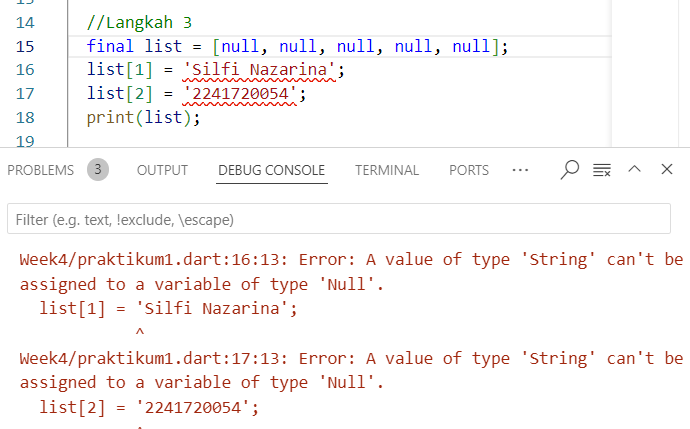
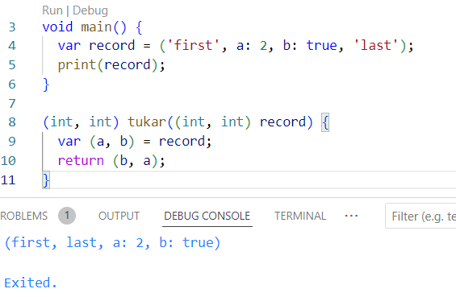
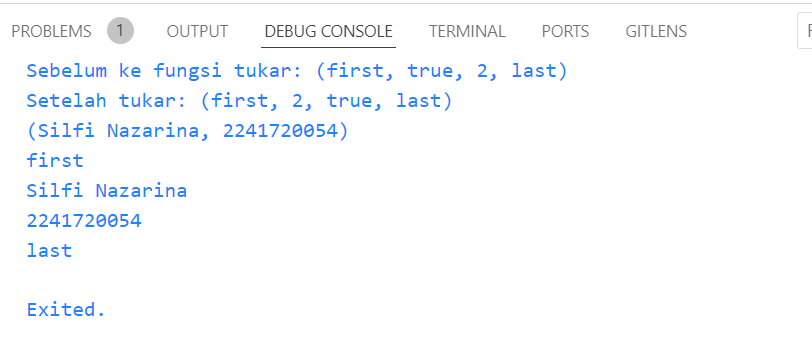

# **PRAKTIKUM**

## **Praktikum 1: Eksperimen Tipe Data List**

### Langkah 1 

```dart
// EKSPERIMEN TIPE DATA LIST

void main(){
  var list = [1, 2, 3]; 
  assert(list.length == 3);     //assert digunakan untuk debugging/pemeriksaan
  assert(list[1] == 2);         //cek apakah list indeks 1 = 2
  print(list.length);
  print(list[1]);

  list[1] = 1;                  //merubah indeks 1 = 1
  assert(list[1] == 1);         //cek apa indeks 1 = 1
  print(list[1]);
}
```

### Langkah 2

Coba **eksekusi (Run) kode** pada langkah 1 tersebut. **Apa yang terjadi? Jelaskan!**


: Menampilkan output dari 3 perintah "print" antara lain:

- **print(list.length);** -> menampilkan panjang list yaitu 3
- **print(list[1]);** -> menampilkan indeks ke-1 dari list sebelum dilakukan perubahan.
- **print(list[1])** -> menampilkan indeks ke-1 list setelah terjadi perubahan nilai indeks ke-1 yang dilakukan di baris **list[1] = 1;**

### Langkah 3

Ubah kode pada langkah 1 menjadi variabel final yang mempunyai index = 5 dengan default value = null. Isilah nama dan NIM Anda pada elemen index ke-1 dan ke-2. Lalu print dan capture hasilnya!



**Apa yang terjadi ?** Jika terjadi error, silakan perbaiki.

: Terjadi error yang disebabkan pendeklarasian list hanya untuk null, karena penambahan nama dan nim menggunakan String ke dalam list inilah yang menghasilkan error karena mencoba menemmpatkan tipe data String yang dideklarasikan hanya menerima null.

Perbaikan:


: menambahkan kelas/tipedata List pada deklarasi list agar list bisa menentukan tipe data yang digunakan untuk mengisi list (dynamic).


## **Praktikum 2: Eksperimen Tipe Data Set**

### Langkah 1

Ketik atau salin kode program berikut ke dalam fungsi main().

```dart
var halogens = {'fluorine', 'chlorine', 'bromine', 'iodine', 'astatine'};
print(halogens);
```

### Langkah 2

Silakan coba eksekusi **(Run) kode** pada langkah 1 tersebut. **Apa yang terjadi? Jelaskan! Lalu perbaiki jika terjadi error.**


: kode menampilkan seluruh indeks dari array *halogens* secara berurutan.

### Langkah 3

Tambahkan kode program berikut, lalu coba eksekusi (Run) kode Anda.

```dart
void main() {
  var halogens = {'fluorine', 'chlorine', 'bromine', 'iodine', 'astatine'};
  print(halogens);

  //tambahan kode program langkah 3
  var names1 = <String>{};    //deklarasi set kosong bertipe String saja
  Set<String> names2 = {};    //deklarasi set kosong bertipe String saja
  var names3 = {};            //map kosong bukan set

  print(names1);
  print(names2);
  print(names3);
}
```
Output:


**Apa yang terjadi ?** Jika terjadi error, silakan perbaiki namun tetap menggunakan ketiga variabel tersebut. Tambahkan elemen nama dan NIM Anda pada kedua variabel Set tersebut dengan dua fungsi berbeda yaitu .add() dan .addAll(). Untuk variabel Map dihapus, nanti kita coba di praktikum selanjutnya.

: penambahan kode menampilkan 2 set kosong dan 1 map kosong yang ditandai dengan tanda braces {}. Berikut penambahan kode selanjutnya:


## **Praktikum 3: Eksperimen Tipe Data Maps**

### Langkah 1

Ketik atau salin kode program berikut ke dalam fungsi main().

```dart
// EKSPERIMEN TIPE DATA MAPS

void main() {
  var gifts = {
    // Key:    Value
    'first': 'partridge',
    'second': 'turtledoves',
    'fifth': 1
  };

  var nobleGases = {
    2: 'helium',
    10: 'neon',
    18: 2,
  };

  print(gifts);
  print(nobleGases);
}
```

### Langkah 2

Silakan coba eksekusi **(Run) kode** pada langkah 1 tersebut. **Apa yang terjadi? Jelaskan!** Lalu perbaiki jika terjadi error.


: Kode mencetak isi dari Map gifts dan nobleGases yang menampilkan semua pasangan key-valuenya.

### Langkah 3

**Tambahkan** kode program berikut, lalu coba eksekusi **(Run) kode** Anda.

```dart
// EKSPERIMEN TIPE DATA MAPS

void main() {
  var gifts = {
    // Key:    Value
    'first': 'partridge',
    'second': 'turtledoves',
    'fifth': 1
  };

  var nobleGases = {
    2: 'helium',
    10: 'neon',
    18: 2,
  };

  //langkah 3
  var mhs1 = Map<String, String>();
  gifts['first'] = 'partridge';
  gifts['second'] = 'turtledoves';
  gifts['fifth'] = 'golden rings';

  var mhs2 = Map<int, String>();
  nobleGases[2] = 'helium';
  nobleGases[10] = 'neon';
  nobleGases[18] = 'argon';

  print(gifts);
  print(nobleGases);
}
```

Output:


: Kode tersebut melakukan perubahan nilai key 'fifth' pada map gifts menjadi 'golden rings' dan perubahan nilai key 18 menjadi 'argon'. Juga penambahan deklarasi Map dengan nama mh1 dan mh2 tetapi masih kosong.

**Tambahkan elemen nama dan NIM Anda pada tiap variabel di atas (gifts, nobleGases, mhs1, dan mhs2). Dokumentasikan hasilnya dan buat laporannya!**


## **Praktikum 4: Eksperimen Tipe Data List: Spread dan Control-fllow Operators**

### Langkah 1

Ketik atau salin kode program berikut ke dalam fungsi main().

```dart
void main() {
  var list = [1, 2, 3];
  var list2 = [0, ...list];
  print(list1);
  print(list2);
  print(list2.length);
}
```

### Langkah 2

Silakan coba eksekusi **(Run) kode** pada langkah 1 tersebut. **Apa yang terjadi? Jelaskan! Lalu perbaiki jika terjadi error.**

Output:


: error karena list1 belum dideklarasikan namun diperintahkan untuk mencetak isinya.

Perbaikan:


: mungkin lebih baik memanggil list yang sudah ada saja.

### Langkah 3

Tambahkan kode program berikut, lalu coba eksekusi (Run) kode Anda. Apa yang terjadi ? Jika terjadi error, silakan perbaiki.


: error karena menugaskan nilai ke list1 yang belum dideklarasikan dan spread operator tidak bekerja karena hal tersebut.

Perbaikan:


Tambahkan variabel list berisi NIM Anda menggunakan Spread Operators. Dokumentasikan hasilnya dan buat laporannya!


: menampilkan output dari langkah 1 tadi dan ditambahkan nim pada list

### Langkah 4

Tambahkan kode program berikut, lalu coba eksekusi (Run) kode Anda.


Apa yang terjadi ? Jika terjadi error, silakan perbaiki. Tunjukkan hasilnya jika variabel promoActive ketika true dan false.

: Error terjadi karena *promoActive* belum dideklarasikan sebelum digunakan .

Perbaikan menggunakan nilai true:


Perbaikan menggunakan nilai false:


: kondisi if (promoActive) digunakan untuk menambahkan elemen jika nilai variabel true dan tidak ditambahkan jika false.

### Langkah 5

Tambahkan kode program berikut, lalu coba eksekusi (Run) kode Anda.


Apa yang terjadi ? Jika terjadi error, silakan perbaiki. Tunjukkan hasilnya jika variabel login mempunyai kondisi lain.

: Error karena variabel login belum dideklarasikan namun sudah dipakai

Perbaikan:


Perbaikan dengan kondisi lain:


: Penggunaan kondisi selain 'Manager' tidak akan menambahkan elemen 'Inventory' ke dalam list

### Langkah 6

Tambahkan kode program berikut, lalu coba eksekusi (Run) kode Anda.


Apa yang terjadi ? Jika terjadi error, silakan perbaiki. Jelaskan manfaat **Collection For** dan dokumentasikan hasilnya.

: kode tersebut menampilkan elemen elemen baru didalam list *listOfStrings* menambahkan # pada setiap nilainya menggunakan perulangan for. **Collection for** bermanfaat untuk membuat list lebih dinamis dengan sintaks yang lebih ringkas. 

## **Praktikum 5: Eksperimen Tipe Data Records**

### Langkah 1

Ketik atau salin kode program berikut ke dalam fungsi main().

```dart
//EKSPERIMEN TIPE DATA RECORDS

void main() {
  var record = ('first', a: 2, b: true, 'last');
  print(record);
}
```

### Langkah 2

Silakan coba eksekusi (Run) kode pada langkah 1 tersebut. Apa yang terjadi? Jelaskan! Lalu perbaiki jika terjadi error.


: Output menampilkan isi record yang terdiri dari beberapa elemen berbeda.

### Langkah 3

Tambahkan kode program berikut di luar scope void main(), lalu coba eksekusi (Run) kode Anda.



**Apa yang terjadi ?** Jika terjadi error, silakan perbaiki. Gunakan fungsi tukar() di dalam main() sehingga tampak jelas proses pertukaran value field di dalam Records.

: Tidak terjadi perubahan apapun, karena kode yang ditambahkan (fungsi) tidak diketik didalam main() maupun pemanggilan fungsi ini didalam main().

Perbaikan:


### Langkah 4

Tambahkan kode program di dalam scope void main(), lalu coba eksekusi (Run) kode Anda.


: Error karena, variabel mahasiswa dideklarasikan sebagai (String, int) tetapi tidak diberikan nilai sebelum dipanggil dengan print(mahasiswa). 

Jika terjadi error, silakan perbaiki. Inisialisasi field nama dan NIM Anda pada variabel record mahasiswa di atas. Dokumentasikan hasilnya dan buat laporannya!


### Langkah 5

Tambahkan kode program berikut di dalam scope void main(), lalu coba eksekusi (Run) kode Anda.;

```dart
//EKSPERIMEN TIPE DATA RECORDS

//menukar nilai a dan b
(String, int, bool, String) tukar((String, bool, int, String) record) {
  var (first, a, b, last) = record;
  // Menukar nilai a dan b
  return (first, b, a, last);
}

void main() {
  // Record dengan elemen a dan b yang akan ditukar (tanpa label)
  var record = ('first', true, 2, 'last');
  
  print('Sebelum ke fungsi tukar: $record');
  
  // Menukar a dan b
  var result = tukar(record);
  print('Setelah tukar: $result');

  // Langkah 4
  // Record type annotation in a variable declaration:
  (String, int) mahasiswa = ('Silfi Nazarina', 2241720054); //perbaikan
  print(mahasiswa);

  var mahasiswa2 = ('first', a: 2, b: true, 'last');

  //langkah 5
  print(mahasiswa2.$1); // Prints 'first'
  print(mahasiswa2.a); // Prints 2
  print(mahasiswa2.b); // Prints true
  print(mahasiswa2.$2); // Prints 'last'
}
```

Output:


Apa yang terjadi ? Jika terjadi error, silakan perbaiki. Gantilah salah satu isi record dengan nama dan NIM Anda, lalu dokumentasikan hasilnya dan buat laporannya!

: Kode berhasil dijalankan tanpa error. Elemen dari record bisa diakses menggunakan label atau indeks tergantung dari apakah elemen-elemen tersebut diberi label atau tidak.

Perbaikan:

```dart
//EKSPERIMEN TIPE DATA RECORDS

//menukar nilai a dan b
(String, int, bool, String) tukar((String, bool, int, String) record) {
  var (first, a, b, last) = record;
  // Menukar nilai a dan b
  return (first, b, a, last);
}

void main() {
  // Record dengan elemen a dan b yang akan ditukar (tanpa label)
  var record = ('first', true, 2, 'last');
  
  print('Sebelum ke fungsi tukar: $record');
  
  // Menukar a dan b
  var result = tukar(record);
  print('Setelah tukar: $result');

  // Langkah 4
  // Record type annotation in a variable declaration:
  (String, int) mahasiswa = ('Silfi Nazarina', 2241720054); //perbaikan
  print(mahasiswa);

  var mahasiswa2 = ('first', 'Silfi Nazarina', '2241720054', 'last');

  //langkah 5
  print(mahasiswa2.$1); // Prints 'first'
  print(mahasiswa2.$2); // Prints 2
  print(mahasiswa2.$3); // Prints true
  print(mahasiswa2.$4); // Prints 'last'
}
```

Output:




