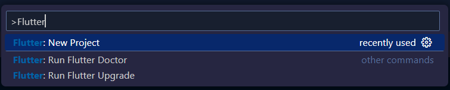
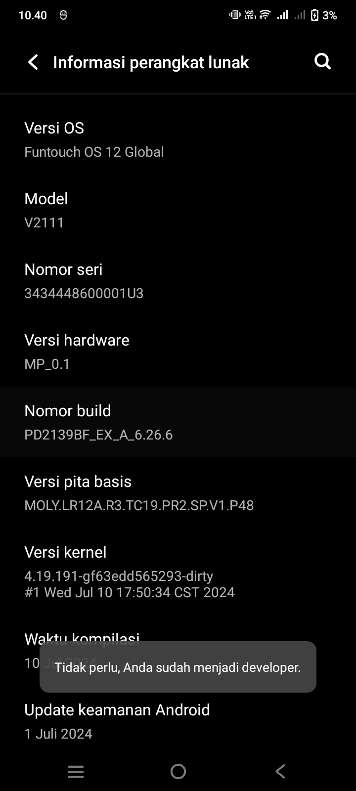
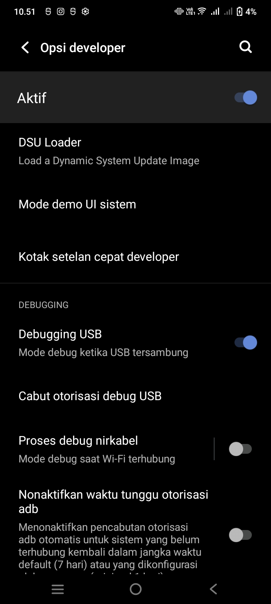
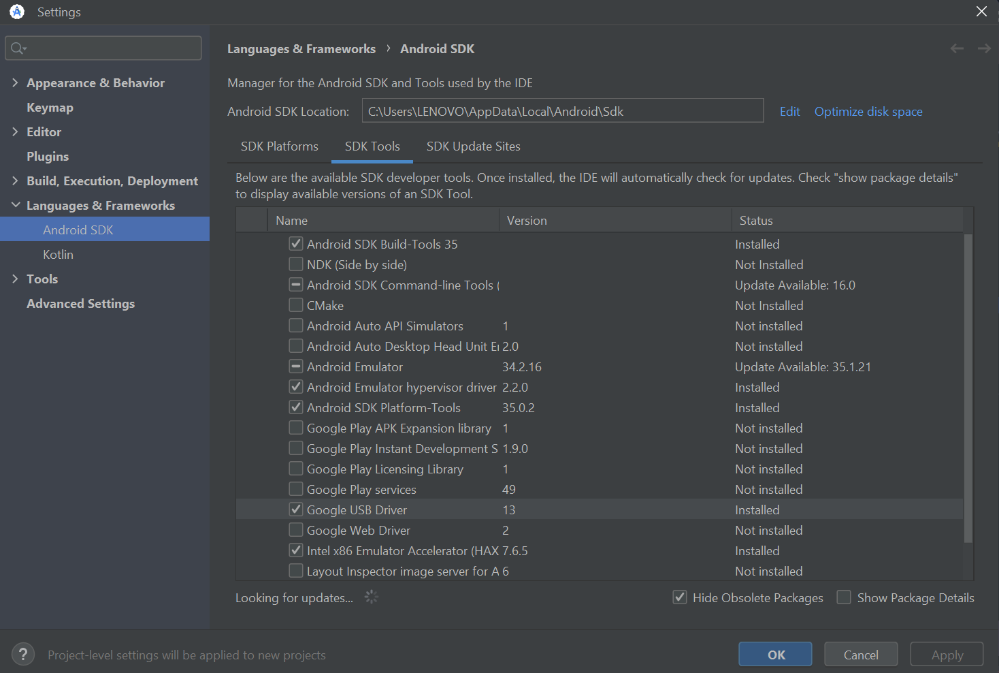
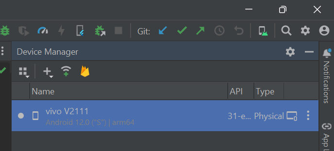
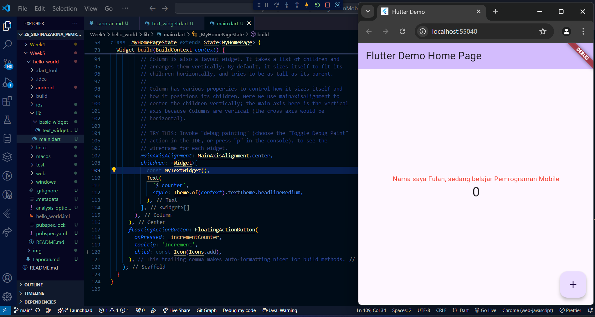
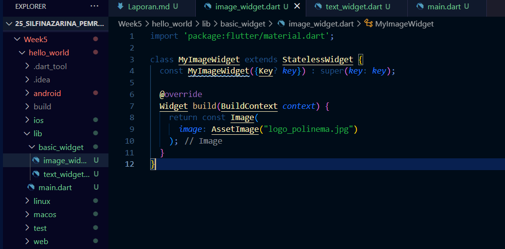
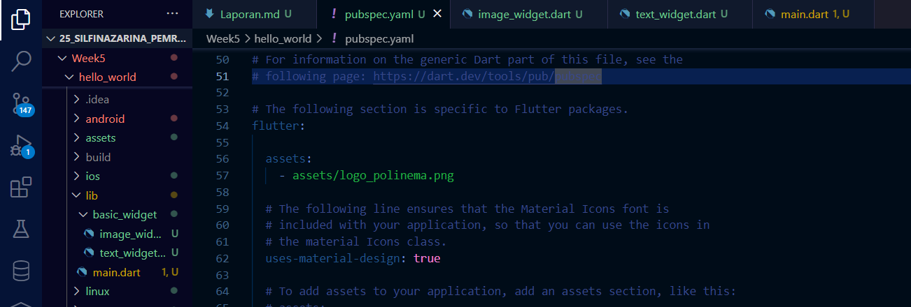

# **PRAKTIKUM**

## PRAKTIKUM 1: Membuat Project Flutter Baru

### Langkah 1

### Langkah 2

### Langkah 3

Buat nama project flutter **hello_world**

### Langkah 4

## PRAKTIKUM 2: Menghubungkan Perangkat Android atau Emulator

### Mengaktifkan Proses Debug USB

1. Di perangkat Android, ketuk Settings > About phone. Ketuk Build number tujuh kali. Anda telah berhasil saat melihat pesan You are now a developer!.

2. Kembali ke Settings, lalu ketuk System > Developer options. Ketuk Developer options, lalu ketuk tombol USB debugging untuk mengaktifkannya.

### Menginstal Driver USB Google (khusus Windows) di Android Studio

### Menjalankan aplikasi di perangkat Android menggunakan kabel

### Menjalankan aplikasi di perangkat Android menggunakan Wi-Fi

## Praktikum 3: Membuat Repository GitHub dan Laporan Praktikum

Dikarenakan github sudah dibuat dan pembuatan laporan sudah berjalan selama beberapa minggu pertemuan, maka langkah praktikum bisa dimulai dari langkah 11

### Langkah 11

Kembali ke VS Code, ubah platform di pojok kanan bawah ke emulator atau device atau bisa juga menggunakan browser Chrome. Lalu coba running project hello_world dengan tekan F5 atau Run > Start Debugging. Tunggu proses kompilasi hingga selesai.

## Praktikum 4: Menerapkan Widget Dasar

### Langkah 1: Text Widget

Buat folder baru basic_widgets di dalam folder lib. Kemudian buat file baru di dalam basic_widgets dengan nama text_widget.dart. Ketik atau salin kode program berikut ke project hello_world Anda pada file text_widget.dart.

Lakukan import file text_widget.dart ke main.dart, lalu ganti bagian text widget dengan kode di atas.

### Langkah 2: Image Widget

Buat sebuah file image_widget.dart di dalam folder basic_widgets dengan isi kode berikut.

Lakukan penyesuaian asset pada file pubspec.yaml dan tambahkan file logo Anda di folder assets project hello_world.

Jangan lupa sesuaikan kode dan import di file main.dart, kemudian run kembali

## Praktikum 5: Menerapkan Widget Material Design dan iOS Cupertino

Lakukan langkah yang sama seperti pada Praktikum 3, yaitu setiap widget dibuat file sendiri lalu import ke main.dart dan screenshot hasilnya.

### Langkah 1: Cupertino Button dan Loading Bar

Buat file di basic_widgets > loading_cupertino.dart. Import stateless widget dari material dan cupertino. Lalu isi kode di dalam method Widget build

