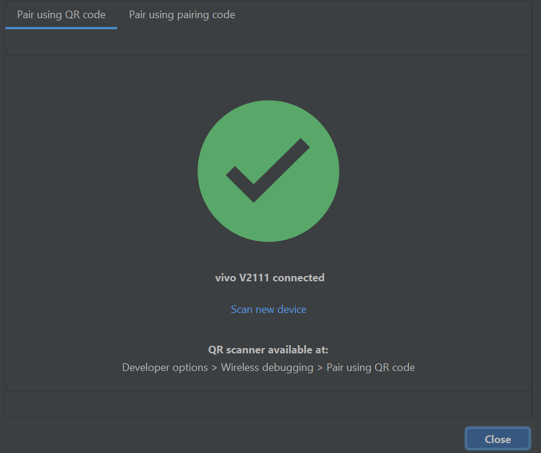

## **Nama: Silfi Nazarina**

## **Kelas : TI-3G / 25**

# **PRAKTIKUM**

## PRAKTIKUM 1: Membuat Project Flutter Baru

### Langkah 1


### Langkah 2


### Langkah 3

Buat nama project flutter **hello_world**


### Langkah 4


## PRAKTIKUM 2: Menghubungkan Perangkat Android atau Emulator

### Mengaktifkan Proses Debug USB

1. Di perangkat Android, ketuk Settings > About phone. Ketuk Build number tujuh kali. Anda telah berhasil saat melihat pesan You are now a developer!.


2. Kembali ke Settings, lalu ketuk System > Developer options. Ketuk Developer options, lalu ketuk tombol USB debugging untuk mengaktifkannya.


### Menginstal Driver USB Google (khusus Windows) di Android Studio


### Menjalankan aplikasi di perangkat Android menggunakan kabel


### Menjalankan aplikasi di perangkat Android menggunakan Wi-Fi




## Praktikum 3: Membuat Repository GitHub dan Laporan Praktikum

Dikarenakan github sudah dibuat dan pembuatan laporan sudah berjalan selama beberapa minggu pertemuan, maka langkah praktikum bisa dimulai dari langkah 11

### Langkah 11

Kembali ke VS Code, ubah platform di pojok kanan bawah ke emulator atau device atau bisa juga menggunakan browser Chrome. Lalu coba running project hello_world dengan tekan F5 atau Run > Start Debugging. Tunggu proses kompilasi hingga selesai.


## Praktikum 4: Menerapkan Widget Dasar

### Langkah 1: Text Widget

Buat folder baru basic_widgets di dalam folder lib. Kemudian buat file baru di dalam basic_widgets dengan nama text_widget.dart. Ketik atau salin kode program berikut ke project hello_world Anda pada file text_widget.dart.


Lakukan import file text_widget.dart ke main.dart, lalu ganti bagian text widget dengan kode di atas.


### Langkah 2: Image Widget

Buat sebuah file image_widget.dart di dalam folder basic_widgets dengan isi kode berikut.


Lakukan penyesuaian asset pada file pubspec.yaml dan tambahkan file logo Anda di folder assets project hello_world.


Jangan lupa sesuaikan kode dan import di file main.dart, kemudian run kembali


## Praktikum 5: Menerapkan Widget Material Design dan iOS Cupertino

Lakukan langkah yang sama seperti pada Praktikum 3, yaitu setiap widget dibuat file sendiri lalu import ke main.dart dan screenshot hasilnya.

### Langkah 1: Cupertino Button dan Loading Bar

Buat file di basic_widgets > loading_cupertino.dart. Import stateless widget dari material dan cupertino. Lalu isi kode seperti perintah pada praktikum dan perbaiki pemanggilan filenya di main.


### Langkah 2: Floating Action Button (FAB)

Buat file di basic_widgets > fab_widget.dart. Import stateless widget dari material. Lalu isi kode di dalam method. Buat file di basic_widgets > loading_cupertino.dart. Import stateless widget dari material dan cupertino. Lalu isi kode seperti perintah pada praktikum dan perbaiki pemanggilan filenya di main.


### Langkah 3: Scaffold Widget

Ubah isi kode main.dart seperti contoh praktikum.


### Langkah 4: Dialog Widget

Ubah isi kode main.dart seperti kode tersebut.


### Langkah 5: Input dan Selection Widget


### Date and Time Picker

Berikut adalah contoh penggunaan Date and Time Pickers.


# **TUGAS PRAKTIKUM**

1. Selesaikan Praktikum 1 sampai 5, lalu dokumentasikan dan push ke repository Anda berupa screenshot setiap hasil pekerjaan beserta penjelasannya di file README.md!

    Jawab: Sudah dilakukan [praktikum](#praktikum)! diatas.

2. Selesaikan Praktikum 2 dan Anda wajib menjalankan aplikasi hello_world pada perangkat fisik (device Android/iOS) agar Anda mempunyai pengalaman untuk menghubungkan ke perangkat fisik. Capture hasil aplikasi di perangkat, lalu buatlah laporan praktikum pada file README.md.

    Jawab: SUdah dilakukan di bagian [praktikum menguhubungkan device](#praktikum-2-menghubungkan-perangkat-android-atau-emulator)! 

3. Pada praktikum 5 mulai dari Langkah 3 sampai 6, buatlah file widget tersendiri di folder basic_widgets, kemudian pada file main.dart cukup melakukan import widget sesuai masing-masing langkah tersebut!

    Jawab: 

    

    kode pada main.dart sebagai berikut:

    ```dart
    import 'package:flutter/material.dart';
    import 'basic_widget/input_selection_widget.dart';
    import 'basic_widget/dialog_widget.dart';
    import 'basic_widget/date_time_pickers.dart';
    import 'basic_widget/scaffold_widget.dart';

    void main() {
    runApp(const MyApp());
    }

    class MyApp extends StatelessWidget {
    const MyApp({Key? key}) : super(key: key);

    @override
    Widget build(BuildContext context) {
        return const MaterialApp(
        home: Row(
            children: [
            Expanded(child: MyInputSelectionWidget()),  //langkah 5
            Expanded(child: MyDialogWidget()),  //langkah 4
            Expanded(child: MyDateTimePicker()),  //langkah 6
            Expanded(child: MyScaffoldWidget()), //langkah 3
            ],
        ),
        );
    }
    }
    ```

    


4. Selesaikan Codelabs: Your first Flutter app, lalu buatlah laporan praktikumnya dan push ke repository GitHub Anda!

    Jawab: 

    ### **Praktikum "Your First Flutter App"**

- #### **Setup Environment**

    Beberapa environment yang dibutuhkan sudah tersedia.

- #### **Create a Project**

    1. Beri nama proyek Anda. Misalnya namer_appatau my_awesome_namer

    

    2. Ganti konten berkas 'pubspec.yaml' dengan beberapa kode tersebut.

    

    3. Ganti konten berkas 'analysis_options.yaml' dengan kode kode tersebut.

    

    4. Terakhir, buka main.dartberkas di bawah lib/direktori dan ubah isi kodenya.

    

    Output terkini:

    

- #### **Add Button**

    1. Tambahkan beberapa baris kode pada main.dart

    

    2. Berikutnya, tambahkan tombol di bagian bawah Column, tepat di bawah contoh kedua Text pada main.dart

    

    3. Tambahkan getNextmetode pada MyAppState

    

    4. Yang tersisa hanyalah memanggil getNextmetode dari panggilan balik tombol.

    

- #### **Make the App Prettier**

    1. Ekstrak widget dengan menulis ulang MyHomePagewidget seperti kode tersebut. Kemudian, panggil menu Refactor . Di VS Code klik kanan bagian kode yang ingin Anda refactor ( Textdalam kasus ini) dan pilih Refactor... dari menu drop-down,
    Di menu Refactor , pilih Extract Widget . Tetapkan nama, seperti BigCard , lalu klik Enter. Ini secara otomatis membuat kelas baru, BigCard, di akhir berkas saat ini. 

    

    2. Sekarang, Tambahkan wrapping widget

    

    3.  Letakkan kursor pada Paddingwidget, buka menu Refactor , lalu pilih Wrap with widget, Kemudian ubah menjadi Card.

    

- #### **Theme and Style**

    1. Lakukan perubahan pada metode BigCard's build().

    

    2. Anda dapat mengubah warna ini, dan skema warna keseluruhan aplikasi, dengan menggulir ke atas MyAppdan mengubah warna benih di ColorSchemesana.

    

- #### **Text Theme**

    Lakukan perubahan pada metode BigCard's .build() untuk mengubah ukuran text lebih besar.

    

- #### **Improve Accessibility**

    Gunakan Textproperti semanticsLabeluntuk mengganti konten visual widget teks dengan konten semantik yang lebih sesuai untuk pembaca layar:

    

- #### **Center the UI**

    1. Buka MyHomePagemetode build(), dan buat perubahan untuk menempatkannya di tengah jendela/layar aplikasi.
    Hasilnya child di dalam Columnsepanjang sumbu utamanya (vertikal).

    

    2. Verifikasi ini dengan menggunakan Widget Inspector..

    

    3. Letakkan kursor Anda di Column, panggil menu Refactor (dengan Ctrl+.atau Cmd+.), dan pilih Wrap with Center.
    Untuk memusatkan secara horizontal.

    

    4. Hilangkan text 'a random AWESOME idea:' karena dengan danya UI sudah cukup masuk akal

    

- #### **Add Functionality (add business logic)**

    Tambahkan beberapa kode pada MyAppState

    

- #### **Add Button**

    Menambahkan tombol 'like' di sebelah kiri tombol 'next'

    

- #### **Add Navigation**

    1. Menambahkan navigasi untuk icon home dan like

    

    2. Menambahkan fungsi dari tiap navigasi untuk beralih halaman

    

    3. Buat ukuran layar responsif

    

- #### **Add New Page**

    Menambahkan halaman baru dan menambahkan fugsi like kedalam halaman tersbeut.

    

    praktikum selesai dilakukan.


5. README.md berisi: capture hasil akhir tiap praktikum (side-by-side, bisa juga berupa file GIF agar terlihat proses perubahan ketika ada aksi dari pengguna) dengan menampilkan NIM dan Nama Anda sebagai ciri pekerjaan Anda.

    Jawab: Hasil praktikum sudah laporkan pada langkah [praktikum](#praktikum)! diatas 

6. Kumpulkan berupa link repository/commit GitHub Anda kepada dosen yang telah disepakati!

    Jawab: https://github.com/Silfinazarina/25_Silfinazarina_PemrogramanMobile/tree/main/Week5 