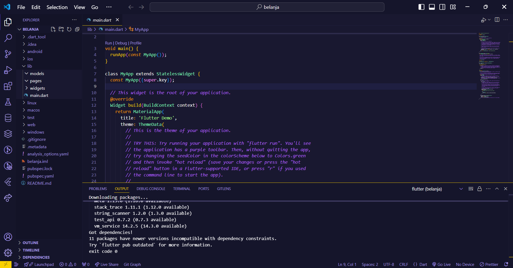
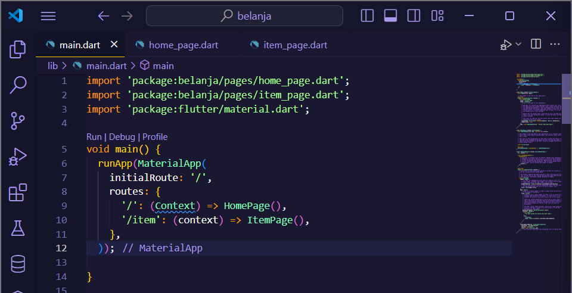
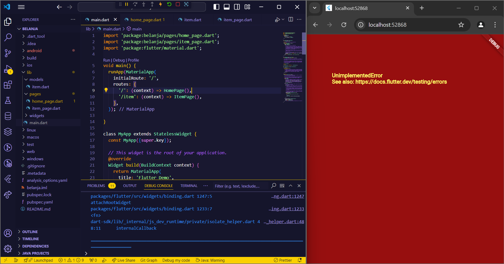
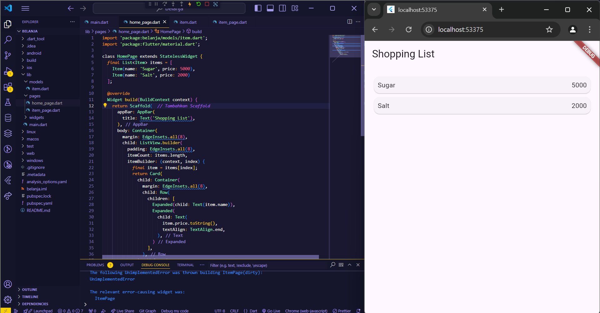
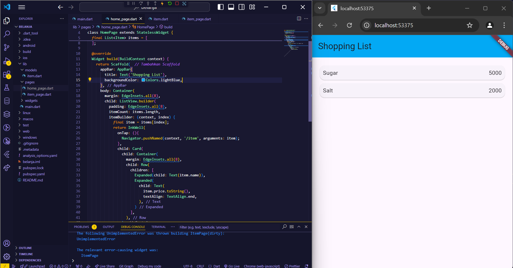
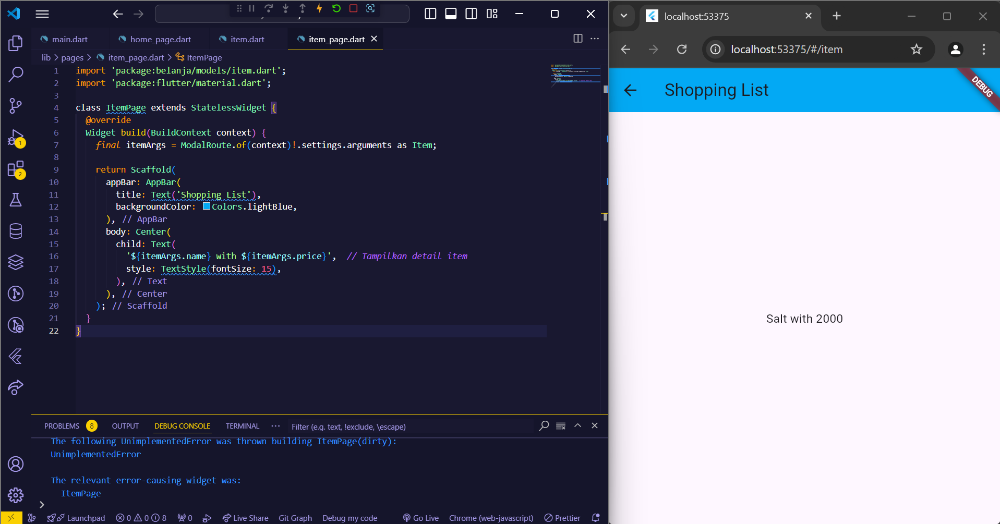
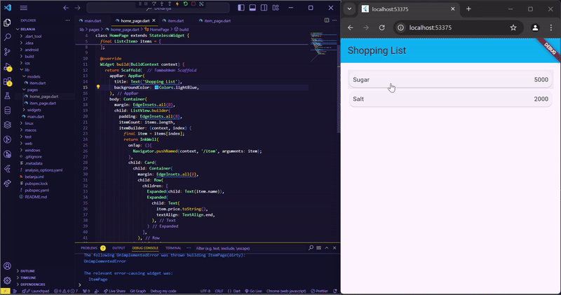
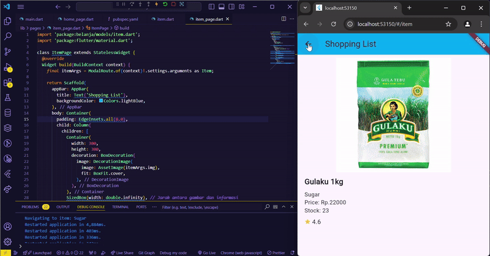
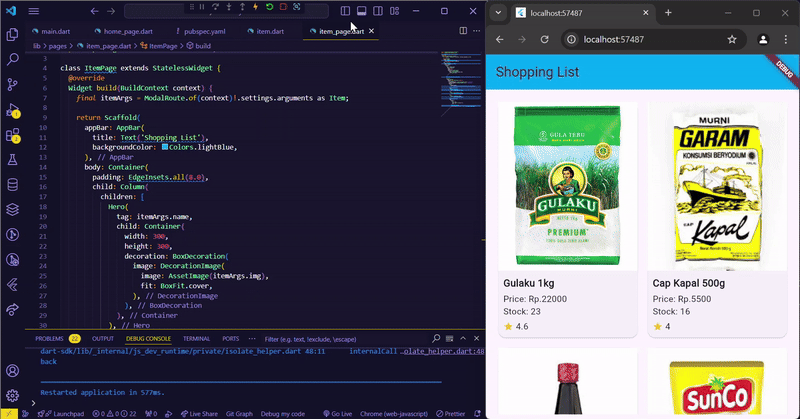
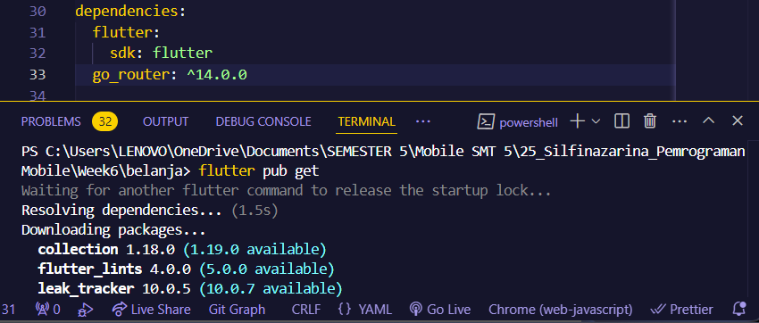

# **SILFI NAZARINA / TI-3G / 25**

# **PRAKTIKUM**

## **Praktikum 1 - Membangun Layout di Flutter**

### **Langkah 1: Buat project baru**

Buat project flutter baru dengan nama **layout_flutter**.


### **Langkah 2: Ubah file lib/main.dart**

Ubah kode **lib/main.dart** sesuai praktikum kemudian isi nama dan NIM Anda di text title.


### **Langkah 3: Identifikasi layout diagram**

- **Identifikasi baris dan kolom.**

    Pada kode diatas belum ada penggunaan row dan column.Saat ini hanya ada Center widget yang menampilkan teks 'Hello World' di tengah layar.

- **Apakah tata letaknya menyertakan kisi-kisi (grid)?**

    Tidak ada penggunaan widget GridView atau Grid di dalam kode.

- **Apakah ada elemen yang tumpang tindih?**

    Tidak ada elemen yang tumpang tindih dalam kode ini. 
    Semua elemen berada pada posisi default, dengan teks berada di tengah layar berkat penggunaan Center widget.

- **Apakah UI memerlukan tab?**

    Saat ini, dalam kode tersebut tidak ada tab yang digunakan. Dan menurut saya untuk output dengan widget itemm 'Hello World' saja 
    tidak terlalu perlu menggunakan tab, kecuali untuk fungsi lebih intens selanjutnya.

- **Perhatikan area yang memerlukan alignment, padding, atau borders.**

    area yang mungkin memerlukan alignment, padding, atau borders adalah teks 'Hello World'. Itu bisa diperbaiki sesuai dengan desain yang diinginkan, 
    apakah teks harus memiliki jarak dari tepi, border, atau diletakkan di tempat tertentu.

### **Langkah 4: Implementasi title row**

Membuat kolom bagian kiri pada judul. Tambahkan kode di bagian atas metode build() di dalam kelas MyApp dengan tambahan kode kode berikut:

1. Letakkan widget Column di dalam widget Expanded agar menyesuaikan ruang yang tersisa di dalam widget Row. Tambahkan properti crossAxisAlignment ke CrossAxisAlignment.start sehingga posisi kolom berada di awal baris.

2. Letakkan baris pertama teks di dalam Container sehingga memungkinkan Anda untuk menambahkan padding = 8. Teks ‘Batu, Malang, Indonesia' di dalam Column, set warna menjadi abu-abu.

3. Dua item terakhir di baris judul adalah ikon bintang, set dengan warna merah, dan teks "41". Seluruh baris ada di dalam Container dan beri padding di sepanjang setiap tepinya sebesar 32 piksel. Kemudian ganti isi body text ‘Hello World' dengan variabel titleSection. Keseluruhan kode seperti berikut:

```dart
import 'package:flutter/material.dart';

void main() => runApp(const MyApp());

class MyApp extends StatelessWidget {
  const MyApp({super.key});

  Widget _buildTitleSelection(){ 
  return Container(
  padding: const EdgeInsets.all(32), //tambah padding 32
  child: Row(
    children: [
      Expanded(
        /* soal 1*/
        child: Column(
          crossAxisAlignment: CrossAxisAlignment.start, //menambahkan CrossAxisAlignment.start
          children: [
            /* soal 2*/
            Container(
              padding: const EdgeInsets.only(bottom: 8), 
              child: const Text(
                'Wisata Gunung di Batu',
                style: TextStyle(
                  fontWeight: FontWeight.bold,
                ),
              ),
            ),
            Text(
              'Batu, Malang, Indonesia',
              style: TextStyle(color: Colors.grey), //ubah ke abu-abu
            ),
          ],
        ),
      ),
      /* soal 3*/
      Icon(
        Icons.star,   //tambah ikon star
        color: Colors.red,  //tambah warna merah
      ),
      const Text('41'),
    ],
  ),
);
}

  @override
  Widget build(BuildContext context) {
    return MaterialApp(
      title: 'Flutter layout: Nama dan NIM Anda',
      home: Scaffold(
        appBar: AppBar(
          title: const Text('SILFI NAZARINA - 2241720054'),
        ),
        body: Column(
          children: [
            _buildTitleSelection(),
          ]
        ),
      ),
    );
  }
}
```


## **Praktikum 2 - Implementasi Button Row**

### **Langkah 1: Buat method Column _buildButtonColumn**

Buatlah metode pembantu pribadi bernama buildButtonColumn(), yang mempunyai parameter warna, Icon dan Text, sehingga dapat mengembalikan kolom dengan widgetnya sesuai dengan warna tertentu.

```dart
import 'package:flutter/material.dart';

void main() => runApp(const MyApp());

class MyApp extends StatelessWidget {
  const MyApp({super.key});

  Widget _buildTitleSelection(){ 
  return Container(
  padding: const EdgeInsets.all(32), //tambah padding 32
  child: Row(
    children: [
      Expanded(
        /* soal 1*/
        child: Column(
          crossAxisAlignment: CrossAxisAlignment.start, //menambahkan CrossAxisAlignment.start
          children: [
            /* soal 2*/
            Container(
              padding: const EdgeInsets.only(bottom: 8), //tambah padding 8
              child: const Text(
                'Wisata Gunung di Batu',
                style: TextStyle(
                  fontWeight: FontWeight.bold,
                ),
              ),
            ),
            Text(
              'Batu, Malang, Indonesia',
              style: TextStyle(color: Colors.grey), //ubah ke abu-abu
            ),
          ],
        ),
      ),
      /* soal 3*/
      Icon(
        Icons.star,   //tambah ikon star
        color: Colors.red,  //tambah warna merah
      ),
      const Text('41'),
    ],
  ),
);
}

  @override
  Widget build(BuildContext context) {
    return MaterialApp(
      title: 'Flutter layout: Nama dan NIM Anda',
      home: Scaffold(
        appBar: AppBar(
          title: const Text('SILFI NAZARINA - 2241720054'),
        ),
        body: Column(
          children: [
            _buildTitleSelection(),
          ]
        ),
      ),
    );
  }

//penambahan method buildButtonColumn langkah 1
  Column _buildButtonColumn(Color color, IconData icon, String label) {
    return Column(
      mainAxisSize: MainAxisSize.min,
      mainAxisAlignment: MainAxisAlignment.center,
      children: [
        Icon(icon, color: color),
        Container(
          margin: const EdgeInsets.only(top: 8),
          child: Text(
            label,
            style: TextStyle(
              fontSize: 12,
              fontWeight: FontWeight.w400,
              color: color,
            ),
          ),
        ),
      ],
    );
  }
}
```

### **Langkah 2: Buat Widget buttonSection**

Buat Fungsi untuk menambahkan ikon langsung ke kolom. Teks berada di dalam Container dengan margin hanya di bagian atas, yang memisahkan teks dari ikon.

Bangun baris yang berisi kolom-kolom ini dengan memanggil fungsi dan set warna, Icon, dan teks khusus melalui parameter ke kolom tersebut. Tambahkan kode berikut tepat di bawah deklarasi titleSection di dalam metode build()

```dart
...
  @override
  Widget build(BuildContext context) {

    //penambahan kode praktikum 2
    Color color = Theme.of(context).primaryColor;

    Widget buttonSection = Row(
      mainAxisAlignment: MainAxisAlignment.spaceEvenly,
      children: [
        _buildButtonColumn(color, Icons.call, 'CALL'),
        _buildButtonColumn(color, Icons.near_me, 'ROUTE'),
        _buildButtonColumn(color, Icons.share, 'SHARE'),
      ],
    );
  }
...
```

### **Langkah 3: Tambah button section ke body**

```dart
...

 @override
  Widget build(BuildContext context) {
    Color color = Theme.of(context).primaryColor;

    Widget buttonSection = Row(
      mainAxisAlignment: MainAxisAlignment.spaceEvenly,
      children: [
        _buildButtonColumn(color, Icons.call, 'CALL'),
        _buildButtonColumn(color, Icons.near_me, 'ROUTE'),
        _buildButtonColumn(color, Icons.share, 'SHARE'),
      ],
    );

    return MaterialApp(
      title: 'Flutter layout: Nama dan NIM Anda',
      home: Scaffold(
        appBar: AppBar(
          title: const Text('SILFI NAZARINA - 2241720054'),
        ),
        body: Column(
          children: [
            _buildTitleSelection(),
            buttonSection     //memaggil method buttonSection
          ]
        ),
      ),
    );
  }
...
```


## **Praktikum 3 - Implementasi Text Section**

### **Langkah 1: Buat Widget textSection**

Tentukan bagian teks sebagai variabel. Masukkan teks ke dalam Container dan tambahkan padding di sepanjang setiap tepinya. Tambahkan kode berikut tepat di bawah deklarasi buttonSection.

```dart
...
@override
  Widget build(BuildContext context) {
    Color color = Theme.of(context).primaryColor;

    Widget buttonSection = Row(
      mainAxisAlignment: MainAxisAlignment.spaceEvenly,
      children: [
        _buildButtonColumn(color, Icons.call, 'CALL'),
        _buildButtonColumn(color, Icons.near_me, 'ROUTE'),
        _buildButtonColumn(color, Icons.share, 'SHARE'),
      ],
    );

  //penambahan variabel textSection
    Widget textSection = Container(
      padding: const EdgeInsets.all(32),
      child: const Text(
        'Museum Angkut merupakan museum transportasi dan tempat wisata modern yang terletak di Kota Batu, Jawa Timur, sekitar 20 km dari Kota Malang.',
        softWrap: true,
      ),
    );

    return MaterialApp(
      title: 'Flutter layout: Nama dan NIM Anda',
      home: Scaffold(
        appBar: AppBar(
          title: const Text('SILFI NAZARINA - 2241720054'),
        ),
        body: Column(
          children: [
            _buildTitleSelection(),
            buttonSection,
            textSection,     
          ]
        ),
      ),
    );
  }
  ...
```

Arti nilai softWrap = true, baris teks akan memenuhi lebar kolom sebelum membungkusnya pada batas kata.

### **Langkah 2: Tambahkan variabel text section ke body**


## **Praktikum 4 - Implementasi image section**

### **Langkah 1: Siapkan aset gambar**

Buatlah folder images di root project layout_flutter. Masukkan file gambar tersebut ke folder images, lalu set nama file tersebut ke file pubspec.yaml


### **Langkah 2: Tambahkan gambar ke body**


### **Langkah 3: Terakhir, ubah menjadi ListView**

Atur semua elemen dalam ListView, bukan Column, karena ListView mendukung scroll yang dinamis saat aplikasi dijalankan pada perangkat yang resolusinya lebih kecil.


# **TUGAS 1**

1. Selesaikan Praktikum 1 sampai 4, lalu dokumentasikan dan push ke repository Anda berupa screenshot setiap hasil pekerjaan beserta penjelasannya di file README.md!

    **Jawab:** Praktikum sudah dikerjakan pada bagian [praktikum](#praktikum)!

2. Silakan implementasikan di project baru "basic_layout_flutter" dengan mengakses sumber ini: https://docs.flutter.dev/codelabs/layout-basics

    **Jawab:** Dikarenakan tugas praktikum ini sama dengan praktikum sebelumnya, praktikum akan dilanjutkan ke praktikum selanjutnya.

3. Kumpulkan link commit repository GitHub Anda kepada dosen yang telah disepakati!

    **Jawab:** https://github.com/room1357/06-layout-dan-navigasi-Silfinazarina 


## **Praktikum 5 - Membangun Navigasi di Flutter**# **TUGAS 1**

### **Langkah 1: Siapkan Project Baru**

Buatlah sebuah project baru Flutter dengan nama belanja dan susunan folder seperti pada gambar.

 

### **Langkah 2: Mendefinisikan Route**

Buatlah dua buah file dart dengan nama **home_page.dart** dan **item_page.dart** pada folder pages. Untuk masing-masing file, deklarasikan class HomePage pada file **home_page.dart** dan ItemPage pada **item_page.dart**. Turunkan class dari StatelessWidget.

- ***home_page.dart:***

```dart
import 'package:flutter/material.dart';

class HomePage extends StatelessWidget {
  @override
  Widget build(BuildContext context) {
    throw UnimplementedError();
  }
}
```

- ***item_page.dart:***

```dart
import 'package:flutter/material.dart';

class ItemPage extends StatelessWidget {
  @override
  Widget build(BuildContext context) {
    // TODO: implement build
    throw UnimplementedError();
  }
}
```

### **Langkah 3: Lengkapi Kode di main.dart**

Halaman HomePage didefinisikan sebagai /. Dan halaman ItemPage didefinisikan sebagai /item. Untuk mendefinisikan halaman awal, anda dapat menggunakan named argument initialRoute.



### **Langkah 4: Membuat data model**

Sebelum melakukan perpindahan halaman dari HomePage ke ItemPage, dibutuhkan proses pemodelan data. Pada desain mockup, dibutuhkan dua informasi yaitu nama dan harga. Untuk menangani hal ini, buatlah sebuah file dengan nama item.dart dan letakkan pada folder models. Pada file ini didefinisikan pemodelan data yang dibutuhkan.

```dart
class Item {
  String name;
  int price;

  Item({
    required this.name,
    required this.price
  });
}
```

### **Langkah 5: Lengkapi kode di class HomePage**

Pada halaman HomePage terdapat ListView widget. Sumber data ListView diambil dari model List dari object Item.

```dart
import 'package:belanja/models/item.dart';
import 'package:flutter/material.dart';

class HomePage extends StatelessWidget {

final List<Item> items = [
  Item(name: 'Sugar', price: 5000),
  Item(name: 'Salt', price: 2000)
];

  @override
  Widget build(BuildContext) {
    throw UnimplementedError();
  }
}
```

### **Langkah 6: Membuat ListView dan itemBuilder**

Untuk menampilkan ListView pada praktikum ini digunakan itemBuilder. Data diambil dari definisi model yang telah dibuat sebelumnya. Untuk menunjukkan batas data satu dan berikutnya digunakan widget Card.

```dart
import 'package:belanja/models/item.dart';
import 'package:flutter/material.dart';

class HomePage extends StatelessWidget {
final List<Item> items = [
  Item(name: 'Sugar', price: 5000),
  Item(name: 'Salt', price: 2000)
];

  @override
  Widget build(BuildContext context) {
    body: Container(
      margin: EdgeInsets.all(8),
      child: ListView.builder(
        padding: EdgeInsets.all(8),
        itemCount: items.length,
        itemBuilder: (context, index){
          final item = items[index];
          return Card(
            child: Container(
              margin: EdgeInsets.all(8),
              child: Row(
                children: [
                  Expanded(child: Text(item.name)),
                  Expanded(
                    child: Text(
                      item.price.toString(),
                      textAlign: TextAlign.end,
                    ),
                  )
                ],
              ),
            ),
          );
        },
      ),
    );
    throw UnimplementedError();
  }
}
```

***Output:***



Muncul output tersebut karena kode **throw UnimplementedError();** belum dihapus yang menyebabkan flutter melempar error ke output karena dianggap kode belum selesai.
Selain itu jika kode tersebut dihilangkan, error terjadi di widget buildnya, karena kode langsung mendeklarasikan body tanpa membungkusnya dalam widget Scaffold. 
Dengan menambahkan Scaffold, halaman akan dirender dengan benar di Flutter, dan daftar belanja (items) akan ditampilkan. Berikut perbaikan kodenya:

```dart
import 'package:belanja/models/item.dart';
import 'package:flutter/material.dart';

class HomePage extends StatelessWidget {
  final List<Item> items = [
    Item(name: 'Sugar', price: 5000),
    Item(name: 'Salt', price: 2000)
  ];

  @override
  Widget build(BuildContext context) {
    return Scaffold(  // Tambahkan Scaffold
      appBar: AppBar(
        title: Text('Shopping List'),
      ),
      body: Container(
        margin: EdgeInsets.all(8),
        child: ListView.builder(
          padding: EdgeInsets.all(8),
          itemCount: items.length,
          itemBuilder: (context, index) {
            final item = items[index];
            return Card(
              child: Container(
                margin: EdgeInsets.all(8),
                child: Row(
                  children: [
                    Expanded(child: Text(item.name)),
                    Expanded(
                      child: Text(
                        item.price.toString(),
                        textAlign: TextAlign.end,
                      ),
                    )
                  ],
                ),
              ),
            );
          },
        ),
      ),
    );
  }
}
```
***Output:***



### **Langkah 7: Menambahkan aksi pada ListView**

Untuk menambahkan sentuhan, letakkan cursor pada widget pembuka Card. Kemudian gunakan shortcut quick fix dari VSCode (Ctrl + . 
pada Windows atau Cmd + . pada MacOS). Sorot menu wrap with widget... Ubah nilai widget menjadi InkWell serta tambahkan named argument onTap yang berisi fungsi 
untuk berpindah ke halaman ItemPage.



Menambahkan warna juga agar sama seperti contoh:
```dart
...
return Scaffold(  // Tambahkan Scaffold
  appBar: AppBar(
    title: Text('Shopping List'),
    backgroundColor: Colors.lightBlue,
  ),
...
```

***Output:***




# **TUGAS 2**

1. Untuk melakukan pengiriman data ke halaman berikutnya, cukup menambahkan informasi arguments pada penggunaan Navigator. Perbarui kode pada bagian Navigator menjadi seperti berikut.

    **Jawab:** 

    

2. Pembacaan nilai yang dikirimkan pada halaman sebelumnya dapat dilakukan menggunakan ModalRoute. Tambahkan kode berikut pada blok fungsi build dalam halaman ItemPage. Setelah nilai didapatkan, anda dapat menggunakannya seperti penggunaan variabel pada umumnya.

    **Jawab:** Penambahan diiringi kode pelengkapnya sebagai objek yang ditampilkan juga.

    ```dart
    import 'package:belanja/models/item.dart';
    import 'package:flutter/material.dart';

    class ItemPage extends StatelessWidget {
      @override
      Widget build(BuildContext context) {
        final itemArgs = ModalRoute.of(context)!.settings.arguments as Item;

        return Scaffold(
          appBar: AppBar(
            title: Text('Shopping List'),
            backgroundColor: Colors.lightBlue,
          ),
          body: Center(
            child: Text(
              '${itemArgs.name} with ${itemArgs.price}',  // Tampilkan detail item
              style: TextStyle(fontSize: 15),
            ),
          ),
        );
      }
    }
    ```

    **Output:**

    

3. Pada hasil akhir dari aplikasi belanja yang telah anda selesaikan, tambahkan atribut foto produk, stok, dan rating. Ubahlah tampilan menjadi GridView seperti di aplikasi marketplace pada umumnya.

    **Jawab:** 
    
  - menambahkan variabel di ***item.dart***:

    ```dart
    class Item {
      String name;
      String brand;
      int price;
      String img;
      int stock;
      double rating;

      Item({
        required this.name,
        required this.brand,
        required this.price,
        required this.img,
        required this.stock,
        required this.rating
      });
    }
    ```

  - Menambahkan gambar ke assets dan deklarasi di ***pubspec.yaml***:

    ```dart
    # To add assets to your application, add an assets section, like this:
      assets:
        - assets/images/bango.jpeg
        - assets/images/gulaku.jpeg
        - assets/images/kapal.jpeg
        - assets/images/sunco.jpeg
    ```

  - Modifikasi kode program pada ***home_page.dart***:
    ```dart
    import 'package:belanja/models/item.dart';
    import 'package:flutter/material.dart';

    class HomePage extends StatelessWidget {
      final List<Item> items = [
        Item(name: 'Sugar', brand: 'Gulaku 1kg', price: 22000, img: 'assets/images/gulaku.jpeg', stock: 23, rating: 4.6),
        Item(name: 'Salt', brand: 'Cap Kapal 500g', price: 5500, img: 'assets/images/kapal.jpeg', stock: 16, rating: 4),
        Item(name: 'Sweet soy sauce', brand: 'Bango 135g', price: 12000, img: 'assets/images/bango.jpeg', stock: 20, rating: 3.8),
        Item(name: 'Cooking Oil', brand: 'Sunco 1L', price: 22000, img: 'assets/images/sunco.jpeg', stock: 9, rating: 4.3)
      ];

      @override
      Widget build(BuildContext context) {
        return Scaffold(
          appBar: AppBar(
            title: Text('Shopping List'),
            backgroundColor: Colors.lightBlue,
          ),
          body: Container(
            margin: EdgeInsets.all(8),
            child: GridView.builder(
              padding: EdgeInsets.all(8),
              itemCount: items.length,
              gridDelegate: SliverGridDelegateWithFixedCrossAxisCount(
                crossAxisCount: 2,  // Menentukan jumlah kolom dalam satu baris
                crossAxisSpacing: 8,
                mainAxisSpacing: 8,
                childAspectRatio: 0.6,  // Mengatur perbandingan tinggi dan lebar item
              ),
              itemBuilder: (context, index) {
                final item = items[index];
                return InkWell(
                  onTap: () {
                    Navigator.pushNamed(context, '/item', arguments: item);
                  },
                  child: Card(
                    child: Column(
                      crossAxisAlignment: CrossAxisAlignment.start,
                      children: [
                        Expanded(
                          child: Image.asset(
                            item.img,
                            fit: BoxFit.cover,
                            width: double.infinity,
                          ),
                        ),
                        Padding(
                          padding: const EdgeInsets.all(8.0),
                          child: Column(
                            crossAxisAlignment: CrossAxisAlignment.start,
                            children: [
                              Text(
                                item.brand,
                                style: TextStyle(
                                  fontWeight: FontWeight.bold,
                                  fontSize: 16,
                                ),
                              ),
                              SizedBox(height: 4),
                              Text('Price: Rp.${item.price}'),
                              Text('Stock: ${item.stock}'),
                              SizedBox(height: 4),
                              Row(
                                children: [
                                  Icon(
                                    Icons.star,
                                    color: Colors.yellow[700],
                                    size: 16,
                                  ),
                                  SizedBox(width: 4),
                                  Text('${item.rating}'),
                                ],
                              ),
                            ],
                          ),
                        ),
                      ],
                    ),
                  ),
                );
              },
            ),
          ),
        );
      }
    }

- Modifikasi kode program ***item_page.dart***:

  ```dart
    import 'package:belanja/models/item.dart';
    import 'package:flutter/material.dart';

    class ItemPage extends StatelessWidget {
      @override
      Widget build(BuildContext context) {
        final itemArgs = ModalRoute.of(context)!.settings.arguments as Item;

        return Scaffold(
          appBar: AppBar(
            title: Text('Shopping List'),
            backgroundColor: Colors.lightBlue,
          ),
          body: Container(
            padding: EdgeInsets.all(8.0), 
            child: Column(
              children: [
                Container(
                  width: 300,  
                  height: 300, 
                  decoration: BoxDecoration(
                    image: DecorationImage(
                      image: AssetImage(itemArgs.img), 
                      fit: BoxFit.cover, 
                    ),
                  ),
                ),
                SizedBox(width: double.infinity), // Jarak antara gambar dan informasi

                Expanded( 
                  child: Padding(
                    padding: const EdgeInsets.all(10.0),
                    child: Column(
                      crossAxisAlignment: CrossAxisAlignment.start, // Rata kiri
                      mainAxisAlignment: MainAxisAlignment.start, // Rata atas
                      children: [
                        Text(
                          itemArgs.brand,
                          style: TextStyle(fontSize: 20, fontWeight: FontWeight.bold),
                        ),
                        SizedBox(height: 8), // Jarak 
                        Text(
                          '${itemArgs.name}',
                          style: TextStyle(fontSize: 15),
                        ), 
                        Text(
                          'Price: Rp.${itemArgs.price}',
                          style: TextStyle(fontSize: 15),
                        ), 
                        Text(
                          'Stock: ${itemArgs.stock}',
                          style: TextStyle(fontSize: 15),
                        ),
                        SizedBox(height: 8), 
                        Row(
                          children: [
                            Icon(
                              Icons.star,
                              color: Colors.yellow[700],
                              size: 16,
                            ),
                            SizedBox(width: 4),
                            Text('${itemArgs.rating}', style: TextStyle(fontSize: 16)),
                          ],
                        ),
                      ],
                    ),
                  ),
                ),
              ],
            ),
          ),
        );
      }
    }
    ```

  ***Output:***

  

4. Silakan implementasikan Hero widget pada aplikasi belanja Anda.

    ***Jawab:***

    membungkus kode image dengan ***Hero()***, pada ***home_page.dart***:

    ```dart
    import 'package:belanja/models/item.dart';
    import 'package:flutter/material.dart';

    class HomePage extends StatelessWidget {
      final List<Item> items = [
        Item(name: 'Sugar', brand: 'Gulaku 1kg', price: 22000, img: 'assets/images/gulaku.jpeg', stock: 23, rating: 4.6),
        Item(name: 'Salt', brand: 'Cap Kapal 500g', price: 5500, img: 'assets/images/kapal.jpeg', stock: 16, rating: 4),
        Item(name: 'Sweet soy sauce', brand: 'Bango 135g', price: 12000, img: 'assets/images/bango.jpeg', stock: 20, rating: 3.8),
        Item(name: 'Cooking Oil', brand: 'Sunco 1L', price: 22000, img: 'assets/images/sunco.jpeg', stock: 9, rating: 4.3)
      ];

      @override
      Widget build(BuildContext context) {
        return Scaffold(
          appBar: AppBar(
            title: Text('Shopping List'),
            backgroundColor: Colors.lightBlue,
          ),
          body: Container(
            margin: EdgeInsets.all(8),
            child: GridView.builder(
              padding: EdgeInsets.all(8),
              itemCount: items.length,
              gridDelegate: SliverGridDelegateWithFixedCrossAxisCount(
                crossAxisCount: 2,  // Menentukan jumlah kolom dalam satu baris
                crossAxisSpacing: 8,
                mainAxisSpacing: 8,
                childAspectRatio: 0.6,  // Mengatur perbandingan tinggi dan lebar item
              ),
              itemBuilder: (context, index) {
                final item = items[index];
                return InkWell(
                  onTap: () {
                    Navigator.pushNamed(context, '/item', arguments: item);
                  },
                  child: Card(
                    child: Column(
                      crossAxisAlignment: CrossAxisAlignment.start,
                      children: [
                        Expanded(
                          child: Hero(
                            tag: item.name,
                            child: Image.asset(
                              item.img,
                              fit: BoxFit.cover,
                              width: double.infinity,
                            ),
                          ),
                        ),
                        Padding(
                          padding: const EdgeInsets.all(8.0),
                          child: Column(
                            crossAxisAlignment: CrossAxisAlignment.start,
                            children: [
                              Text(
                                item.brand,
                                style: TextStyle(
                                  fontWeight: FontWeight.bold,
                                  fontSize: 16,
                                ),
                              ),
                              SizedBox(height: 4),
                              Text('Price: Rp.${item.price}'),
                              Text('Stock: ${item.stock}'),
                              SizedBox(height: 4),
                              Row(
                                children: [
                                  Icon(
                                    Icons.star,
                                    color: Colors.yellow[700],
                                    size: 16,
                                  ),
                                  SizedBox(width: 4),
                                  Text('${item.rating}'),
                                ],
                              ),
                            ],
                          ),
                        ),
                      ],
                    ),
                  ),
                );
              },
            ),
          ),
        );
      }
    }
    ```

- ***item_page.dart:***

    ```dart
    import 'package:belanja/models/item.dart';
    import 'package:flutter/material.dart';

    class ItemPage extends StatelessWidget {
      @override
      Widget build(BuildContext context) {
        final itemArgs = ModalRoute.of(context)!.settings.arguments as Item;

        return Scaffold(
          appBar: AppBar(
            title: Text('Shopping List'),
            backgroundColor: Colors.lightBlue,
          ),
          body: Container(
            padding: EdgeInsets.all(8.0), 
            child: Column(
              children: [
                Hero(
                  tag: itemArgs.name,
                  child: Container(
                    width: 300,  
                    height: 300, 
                    decoration: BoxDecoration(
                      image: DecorationImage(
                        image: AssetImage(itemArgs.img), 
                        fit: BoxFit.cover, 
                      ),
                    ),
                  ),
                ),
                SizedBox(width: double.infinity), // Jarak antara gambar dan informasi

                Expanded( 
                  child: Padding(
                    padding: const EdgeInsets.all(10.0),
                    child: Column(
                      crossAxisAlignment: CrossAxisAlignment.start, // Rata kiri
                      mainAxisAlignment: MainAxisAlignment.start, // Rata atas
                      children: [
                        Text(
                          itemArgs.brand,
                          style: TextStyle(fontSize: 20, fontWeight: FontWeight.bold),
                        ),
                        SizedBox(height: 8), 
                        Text(
                          '${itemArgs.name}',
                          style: TextStyle(fontSize: 15),
                        ), 
                        Text(
                          'Price: Rp.${itemArgs.price}',
                          style: TextStyle(fontSize: 15),
                        ), 
                        Text(
                          'Stock: ${itemArgs.stock}',
                          style: TextStyle(fontSize: 15),
                        ),
                        SizedBox(height: 8), 
                        Row(
                          children: [
                            Icon(
                              Icons.star,
                              color: Colors.yellow[700],
                              size: 16,
                            ),
                            SizedBox(width: 4),
                            Text('${itemArgs.rating}', style: TextStyle(fontSize: 16)),
                          ],
                        ),
                      ],
                    ),
                  ),
                ),
              ],
            ),
          ),
        );
      }
    }
    ```

- ***Output animasi Card:***

  

4. Sesuaikan dan modifikasi tampilan sehingga menjadi aplikasi yang menarik. Selain itu, pecah widget menjadi kode yang lebih kecil. Tambahkan Nama dan NIM di footer aplikasi belanja Anda.

    **Jawab:** Berikut penyesuaian dan modifikasi kode program setelah pemecahan widget.

- ***models/item.dart***

  ```dart
  class Item {
    String name;
    String brand;
    int price;
    String img;
    int stock;
    double rating;

    Item({
      required this.name,
      required this.brand,
      required this.price,
      required this.img,
      required this.stock,
      required this.rating
    });
  }
  ```

- ***widgets/item_card.dart***

  ```dart
  import 'package:belanja/models/item.dart';
  import 'package:flutter/material.dart';

  class ItemCard extends StatelessWidget {
    final Item item;

    ItemCard({required this.item});

    @override
    Widget build(BuildContext context) {
      return InkWell(
        onTap: () {
          Navigator.pushNamed(context, '/item', arguments: item);
        },
        child: Card(
          child: Column(
            crossAxisAlignment: CrossAxisAlignment.start,
            children: [
              Expanded(
                child: Hero(
                  tag: item.name,
                  child: Image.asset(
                    item.img,
                    fit: BoxFit.cover,
                    width: double.infinity,
                  ),
                ),
              ),
              Padding(
                padding: const EdgeInsets.all(8.0),
                child: Column(
                  crossAxisAlignment: CrossAxisAlignment.start,
                  children: [
                    Text(
                      item.brand,
                      style: TextStyle(
                        fontWeight: FontWeight.bold,
                        fontSize: 16,
                      ),
                    ),
                    SizedBox(height: 4),
                    Text('Price: Rp.${item.price}'),
                    Text('Stock: ${item.stock}'),
                    SizedBox(height: 4),
                    Row(
                      children: [
                        Icon(
                          Icons.star,
                          color: Colors.yellow[700],
                          size: 16,
                        ),
                        SizedBox(width: 4),
                        Text('${item.rating}'),
                      ],
                    ),
                  ],
                ),
              ),
            ],
          ),
        ),
      );
    }
  }
  ```

- ***widgets/item_details.dart***

  ```dart
  import 'package:belanja/models/item.dart';
  import 'package:flutter/material.dart';

  class ItemDetails extends StatelessWidget {
    final Item item;

    ItemDetails({required this.item});

    @override
    Widget build(BuildContext context) {
      return Container(
        padding: EdgeInsets.all(8.0),
        child: Column(
          children: [
            Hero(
              tag: item.name,
              child: Container(
                width: 300,
                height: 300,
                decoration: BoxDecoration(
                  image: DecorationImage(
                    image: AssetImage(item.img),
                    fit: BoxFit.cover,
                  ),
                ),
              ),
            ),
            SizedBox(height: 10), // Jarak antara gambar dan informasi
            Expanded(
              child: Padding(
                padding: const EdgeInsets.all(10.0),
                child: Column(
                  crossAxisAlignment: CrossAxisAlignment.start,
                  mainAxisAlignment: MainAxisAlignment.start,
                  children: [
                    Text(
                      item.brand,
                      style: TextStyle(fontSize: 20, fontWeight: FontWeight.bold),
                    ),
                    SizedBox(height: 8), // Jarak 
                    Text(
                      '${item.name}',
                      style: TextStyle(fontSize: 15),
                    ),
                    Text(
                      'Price: Rp.${item.price}',
                      style: TextStyle(fontSize: 15),
                    ),
                    Text(
                      'Stock: ${item.stock}',
                      style: TextStyle(fontSize: 15),
                    ),
                    SizedBox(height: 8),
                    Row(
                      children: [
                        Icon(
                          Icons.star,
                          color: Colors.yellow[700],
                          size: 16,
                        ),
                        SizedBox(width: 4),
                        Text('${item.rating}', style: TextStyle(fontSize: 16)),
                      ],
                    ),
                  ],
                ),
              ),
            ),
          ],
        ),
      );
    }
  }
  ```

- ***widget/footer.dart***

  ```dart
  import 'package:flutter/material.dart';

  class Footer extends StatelessWidget {
    const Footer({super.key});

    @override
    Widget build(BuildContext context) {
      return Container(
        height: 40,
        color: const Color.fromARGB(177, 255, 255, 255),
        child: Center(
          child: Text(
            '© 2241720054 | Silfi Nazarina',
            style: TextStyle(color: Colors.grey),
          ),
        ),
      );
    }
  }
  ```

- ***pages/home_page.dart***

  ```dart
  // home_page.dart
  import 'package:belanja/models/item.dart';
  import 'package:belanja/widgets/footer.dart';
  import 'package:belanja/widgets/item_card.dart'; // Tambahkan import ItemCard
  import 'package:flutter/material.dart';

  class HomePage extends StatelessWidget {
    final List<Item> items = [
      Item(name: 'Sugar', brand: 'Gulaku 1kg', price: 22000, img: 'assets/images/gulaku.jpeg', stock: 23, rating: 4.6),
      Item(name: 'Salt', brand: 'Cap Kapal 500g', price: 5500, img: 'assets/images/kapal.jpeg', stock: 16, rating: 4),
      Item(name: 'Sweet soy sauce', brand: 'Bango 135g', price: 12000, img: 'assets/images/bango.jpeg', stock: 20, rating: 3.8),
      Item(name: 'Cooking Oil', brand: 'Sunco 1L', price: 22000, img: 'assets/images/sunco.jpeg', stock: 9, rating: 4.3)
    ];

    @override
    Widget build(BuildContext context) {
      return Scaffold(
        appBar: AppBar(
          title: Text('Shopping List'),
          backgroundColor: Colors.lightBlue,
        ),
        body: Container(
          margin: EdgeInsets.all(8),
          child: GridView.builder(
            padding: EdgeInsets.all(8),
            itemCount: items.length,
            gridDelegate: SliverGridDelegateWithFixedCrossAxisCount(
              crossAxisCount: 2,
              crossAxisSpacing: 8,
              mainAxisSpacing: 8,
              childAspectRatio: 0.6,
            ),
            itemBuilder: (context, index) {
              final item = items[index];
              return ItemCard(item: item); // Gunakan widget ItemCard
            },
          ),
        ),
        bottomNavigationBar: Footer(), // Menambahkan Footer di bawah
      );
    }
  }
  ```

- ***pages/item_page.dart***

  ```dart
  import 'package:belanja/models/item.dart';
  import 'package:belanja/widgets/item_details.dart';
  import 'package:flutter/material.dart';

  class ItemPage extends StatelessWidget {
    const ItemPage({super.key});

    @override
    Widget build(BuildContext context) {
      final Item itemArgs = ModalRoute.of(context)!.settings.arguments as Item;

      return Scaffold(
        appBar: AppBar(
          title: Text('Item Details'),
          backgroundColor: Colors.lightBlue,
        ),
        body: ItemDetails(item: itemArgs), // Gunakan widget ItemDetails
      );
    }
  }
  ```

- ***main.dart***

  ```dart
  import 'package:flutter/material.dart';
  import 'package:belanja/pages/home_page.dart';
  import 'package:belanja/pages/item_page.dart';

  void main() {
    runApp(MyApp());
  }

  class MyApp extends StatelessWidget {
    @override
    Widget build(BuildContext context) {
      return MaterialApp(
        initialRoute: '/',
        routes: {
          '/': (context) => HomePage(),
          '/item': (context) => ItemPage(),
        },
      );
    }
  }
  ```

  ***Output:***

  

5. Selesaikan Praktikum 5: Navigasi dan Rute tersebut. Cobalah modifikasi menggunakan plugin go_router, lalu dokumentasikan dan push ke repository Anda berupa screenshot setiap hasil pekerjaan beserta penjelasannya di file README.md. Kumpulkan link commit repository GitHub Anda kepada dosen yang telah disepakati!

  **Jawab:**

  ### Percobaan menggunakan ***go_router***

  1. Menambahkan Dependency ***go_router***

  Menambahkan go_router di file pubspec.yaml bertujuan untuk mengunduh dan mengintegrasikan package ini ke dalam aplikasi Flutter. Package ini mempermudah pengelolaan navigasi antar halaman (rute).

  

  2. Setup router di ***main.dart***

  Untuk mendefinisikan router menggunakan GoRouter.

  ```dart
  import 'package:flutter/material.dart';
  import 'package:belanja/pages/home_page.dart';
  import 'package:belanja/pages/item_page.dart';
  import 'package:go_router/go_router.dart';
  import 'package:belanja/models/item.dart';

  void main() {
    runApp(MyApp());
  }

  class MyApp extends StatelessWidget {
    //penggunaan go_route
    final GoRouter _router = GoRouter(
      routes: [
        GoRoute(
          path: '/',
          builder: (context, state) => HomePage(),
        ),
        GoRoute(
          path: '/item',
          builder: (context, state) {
            final Item item = state.extra as Item; // Mengambil data dari extra
            return ItemPage(item: item);
          },
        ),
      ],
    );

    @override
    Widget build(BuildContext context) {
      return MaterialApp.router(
        routerConfig: _router,
        title: 'Shopping App',
        theme: ThemeData(
          primarySwatch: Colors.lightBlue,
        ),
      );
    }
  }
  ```

3. Penerapan go_route pada item_card.dart

```dart
...
return InkWell(
      //penggunaan go_route
      onTap: () {
        context.go('/item', extra: item);
      },
...
```

**Output:**

