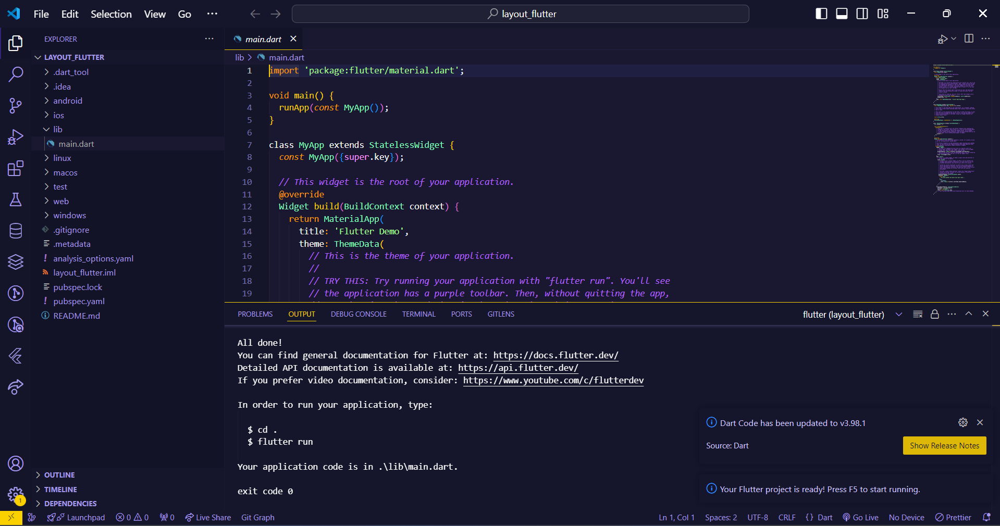
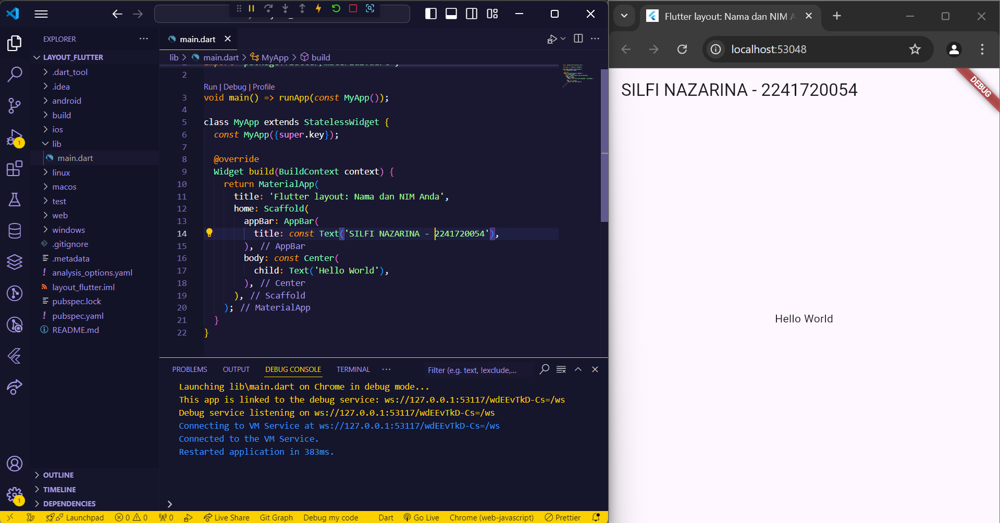
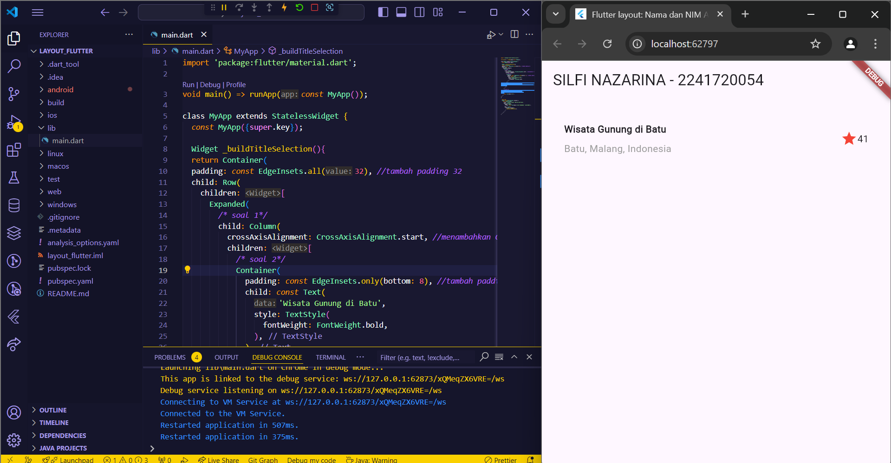
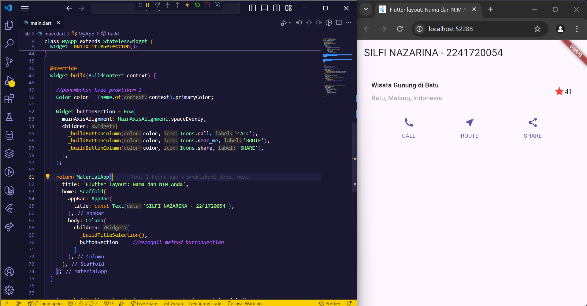
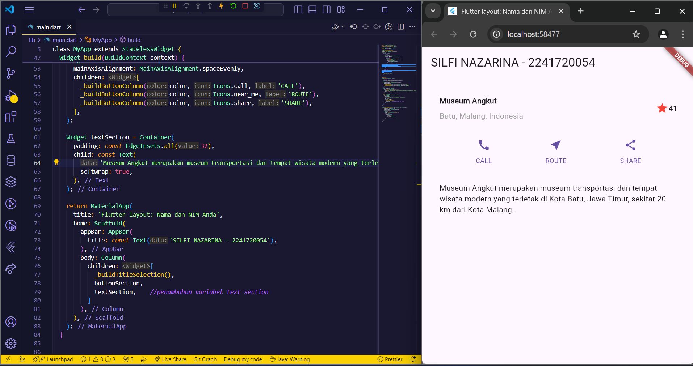
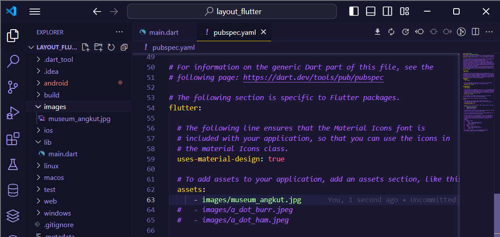
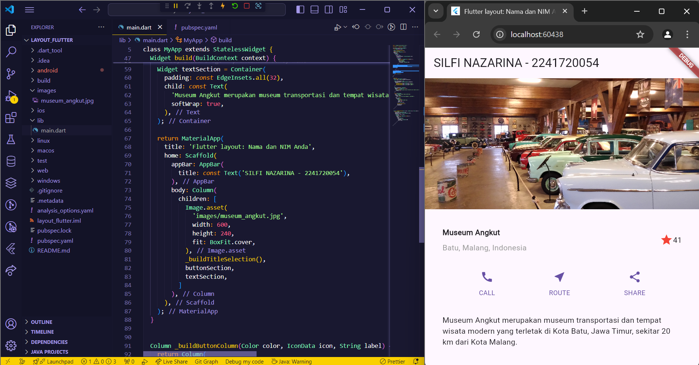
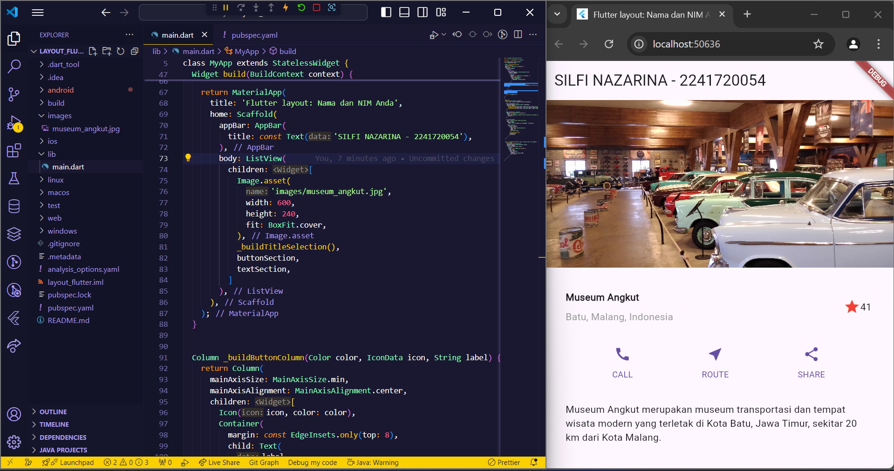

# **SILFI NAZARINA / TI-3G / 25**

# **PRAKTIKUM**

## **Praktikum 1 - Membangun Layout di Flutter**

### **Langkah 1: Buat project baru**

Buat project flutter baru dengan nama **layout_flutter**.



### **Langkah 2: Ubah file lib/main.dart**

Ubah kode **lib/main.dart** sesuai praktikum kemudian isi nama dan NIM Anda di text title.



### **Langkah 3: Identifikasi layout diagram**

- **Identifikasi baris dan kolom.**

    Pada kode diatas belum ada penggunaan row dan column.Saat ini hanya ada Center widget yang menampilkan teks 'Hello World' di tengah layar.

- **Apakah tata letaknya menyertakan kisi-kisi (grid)?**

    Tidak ada penggunaan widget GridView atau Grid di dalam kode.

- **Apakah ada elemen yang tumpang tindih?**

    Tidak ada elemen yang tumpang tindih dalam kode ini. 
    Semua elemen berada pada posisi default, dengan teks berada di tengah layar berkat penggunaan Center widget.

- **Apakah UI memerlukan tab?**

    Saat ini, dalam kode tersebut tidak ada tab yang digunakan. Dan menurut saya untuk output dengan widget itemm 'Hello World' saja 
    tidak terlalu perlu menggunakan tab, kecuali untuk fungsi lebih intens selanjutnya.

- **Perhatikan area yang memerlukan alignment, padding, atau borders.**

    area yang mungkin memerlukan alignment, padding, atau borders adalah teks 'Hello World'. Itu bisa diperbaiki sesuai dengan desain yang diinginkan, 
    apakah teks harus memiliki jarak dari tepi, border, atau diletakkan di tempat tertentu.

### **Langkah 4: Implementasi title row**

Membuat kolom bagian kiri pada judul. Tambahkan kode di bagian atas metode build() di dalam kelas MyApp dengan tambahan kode kode berikut:

1. Letakkan widget Column di dalam widget Expanded agar menyesuaikan ruang yang tersisa di dalam widget Row. Tambahkan properti crossAxisAlignment ke CrossAxisAlignment.start sehingga posisi kolom berada di awal baris.

2. Letakkan baris pertama teks di dalam Container sehingga memungkinkan Anda untuk menambahkan padding = 8. Teks ‘Batu, Malang, Indonesia' di dalam Column, set warna menjadi abu-abu.

3. Dua item terakhir di baris judul adalah ikon bintang, set dengan warna merah, dan teks "41". Seluruh baris ada di dalam Container dan beri padding di sepanjang setiap tepinya sebesar 32 piksel. Kemudian ganti isi body text ‘Hello World' dengan variabel titleSection. Keseluruhan kode seperti berikut:

```dart
import 'package:flutter/material.dart';

void main() => runApp(const MyApp());

class MyApp extends StatelessWidget {
  const MyApp({super.key});

  Widget _buildTitleSelection(){ 
  return Container(
  padding: const EdgeInsets.all(32), //tambah padding 32
  child: Row(
    children: [
      Expanded(
        /* soal 1*/
        child: Column(
          crossAxisAlignment: CrossAxisAlignment.start, //menambahkan CrossAxisAlignment.start
          children: [
            /* soal 2*/
            Container(
              padding: const EdgeInsets.only(bottom: 8), //tambah padding 8
              child: const Text(
                'Wisata Gunung di Batu',
                style: TextStyle(
                  fontWeight: FontWeight.bold,
                ),
              ),
            ),
            Text(
              'Batu, Malang, Indonesia',
              style: TextStyle(color: Colors.grey), //ubah ke abu-abu
            ),
          ],
        ),
      ),
      /* soal 3*/
      Icon(
        Icons.star,   //tambah ikon star
        color: Colors.red,  //tambah warna merah
      ),
      const Text('41'),
    ],
  ),
);
}

  @override
  Widget build(BuildContext context) {
    return MaterialApp(
      title: 'Flutter layout: Nama dan NIM Anda',
      home: Scaffold(
        appBar: AppBar(
          title: const Text('SILFI NAZARINA - 2241720054'),
        ),
        body: Column(
          children: [
            _buildTitleSelection(),
          ]
        ),
      ),
    );
  }
}
```


## **Praktikum 2 - Implementasi Button Row**

### **Langkah 1: Buat method Column _buildButtonColumn**

Buatlah metode pembantu pribadi bernama buildButtonColumn(), yang mempunyai parameter warna, Icon dan Text, sehingga dapat mengembalikan kolom dengan widgetnya sesuai dengan warna tertentu.

```dart
import 'package:flutter/material.dart';

void main() => runApp(const MyApp());

class MyApp extends StatelessWidget {
  const MyApp({super.key});

  Widget _buildTitleSelection(){ 
  return Container(
  padding: const EdgeInsets.all(32), //tambah padding 32
  child: Row(
    children: [
      Expanded(
        /* soal 1*/
        child: Column(
          crossAxisAlignment: CrossAxisAlignment.start, //menambahkan CrossAxisAlignment.start
          children: [
            /* soal 2*/
            Container(
              padding: const EdgeInsets.only(bottom: 8), //tambah padding 8
              child: const Text(
                'Wisata Gunung di Batu',
                style: TextStyle(
                  fontWeight: FontWeight.bold,
                ),
              ),
            ),
            Text(
              'Batu, Malang, Indonesia',
              style: TextStyle(color: Colors.grey), //ubah ke abu-abu
            ),
          ],
        ),
      ),
      /* soal 3*/
      Icon(
        Icons.star,   //tambah ikon star
        color: Colors.red,  //tambah warna merah
      ),
      const Text('41'),
    ],
  ),
);
}

  @override
  Widget build(BuildContext context) {
    return MaterialApp(
      title: 'Flutter layout: Nama dan NIM Anda',
      home: Scaffold(
        appBar: AppBar(
          title: const Text('SILFI NAZARINA - 2241720054'),
        ),
        body: Column(
          children: [
            _buildTitleSelection(),
          ]
        ),
      ),
    );
  }

//penambahan method buildButtonColumn langkah 1
  Column _buildButtonColumn(Color color, IconData icon, String label) {
    return Column(
      mainAxisSize: MainAxisSize.min,
      mainAxisAlignment: MainAxisAlignment.center,
      children: [
        Icon(icon, color: color),
        Container(
          margin: const EdgeInsets.only(top: 8),
          child: Text(
            label,
            style: TextStyle(
              fontSize: 12,
              fontWeight: FontWeight.w400,
              color: color,
            ),
          ),
        ),
      ],
    );
  }
}
```

### **Langkah 2: Buat Widget buttonSection**

Buat Fungsi untuk menambahkan ikon langsung ke kolom. Teks berada di dalam Container dengan margin hanya di bagian atas, yang memisahkan teks dari ikon.

Bangun baris yang berisi kolom-kolom ini dengan memanggil fungsi dan set warna, Icon, dan teks khusus melalui parameter ke kolom tersebut. Tambahkan kode berikut tepat di bawah deklarasi titleSection di dalam metode build()

```dart
...
  @override
  Widget build(BuildContext context) {

    //penambahan kode praktikum 2
    Color color = Theme.of(context).primaryColor;

    Widget buttonSection = Row(
      mainAxisAlignment: MainAxisAlignment.spaceEvenly,
      children: [
        _buildButtonColumn(color, Icons.call, 'CALL'),
        _buildButtonColumn(color, Icons.near_me, 'ROUTE'),
        _buildButtonColumn(color, Icons.share, 'SHARE'),
      ],
    );
  }
...
```

### **Langkah 3: Tambah button section ke body**

```dart
...

 @override
  Widget build(BuildContext context) {
    Color color = Theme.of(context).primaryColor;

    Widget buttonSection = Row(
      mainAxisAlignment: MainAxisAlignment.spaceEvenly,
      children: [
        _buildButtonColumn(color, Icons.call, 'CALL'),
        _buildButtonColumn(color, Icons.near_me, 'ROUTE'),
        _buildButtonColumn(color, Icons.share, 'SHARE'),
      ],
    );

    return MaterialApp(
      title: 'Flutter layout: Nama dan NIM Anda',
      home: Scaffold(
        appBar: AppBar(
          title: const Text('SILFI NAZARINA - 2241720054'),
        ),
        body: Column(
          children: [
            _buildTitleSelection(),
            buttonSection     //memaggil method buttonSection
          ]
        ),
      ),
    );
  }

...
```


## **Praktikum 3 - Implementasi Text Section**

### **Langkah 1: Buat Widget textSection**

Tentukan bagian teks sebagai variabel. Masukkan teks ke dalam Container dan tambahkan padding di sepanjang setiap tepinya. Tambahkan kode berikut tepat di bawah deklarasi buttonSection.

```dart
...
@override
  Widget build(BuildContext context) {
    Color color = Theme.of(context).primaryColor;

    Widget buttonSection = Row(
      mainAxisAlignment: MainAxisAlignment.spaceEvenly,
      children: [
        _buildButtonColumn(color, Icons.call, 'CALL'),
        _buildButtonColumn(color, Icons.near_me, 'ROUTE'),
        _buildButtonColumn(color, Icons.share, 'SHARE'),
      ],
    );

  //penambahan variabel textSection
    Widget textSection = Container(
      padding: const EdgeInsets.all(32),
      child: const Text(
        'Museum Angkut merupakan museum transportasi dan tempat wisata modern yang terletak di Kota Batu, Jawa Timur, sekitar 20 km dari Kota Malang.',
        softWrap: true,
      ),
    );

    return MaterialApp(
      title: 'Flutter layout: Nama dan NIM Anda',
      home: Scaffold(
        appBar: AppBar(
          title: const Text('SILFI NAZARINA - 2241720054'),
        ),
        body: Column(
          children: [
            _buildTitleSelection(),
            buttonSection,
            textSection,     
          ]
        ),
      ),
    );
  }
  ...
```

Arti nilai softWrap = true, baris teks akan memenuhi lebar kolom sebelum membungkusnya pada batas kata.

### **Langkah 2: Tambahkan variabel text section ke body**



## **Praktikum 4 - Implementasi image section**

### **Langkah 1: Siapkan aset gambar**

Buatlah folder images di root project layout_flutter. Masukkan file gambar tersebut ke folder images, lalu set nama file tersebut ke file pubspec.yaml



### **Langkah 2: Tambahkan gambar ke body**



### **Langkah 3: Terakhir, ubah menjadi ListView**

Atur semua elemen dalam ListView, bukan Column, karena ListView mendukung scroll yang dinamis saat aplikasi dijalankan pada perangkat yang resolusinya lebih kecil.

