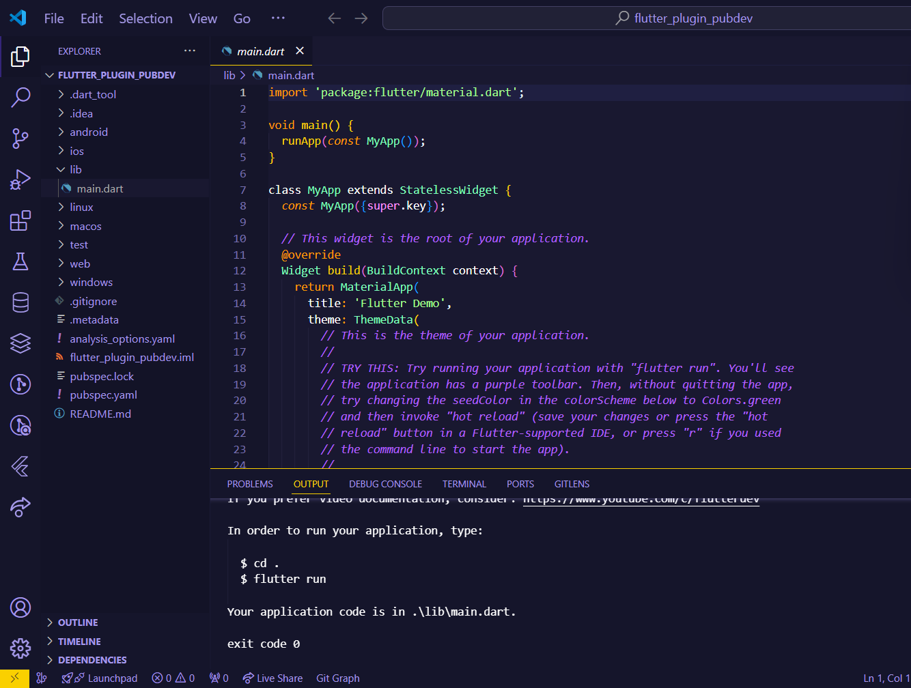
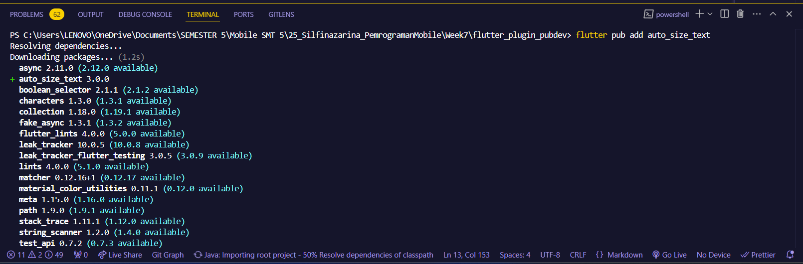
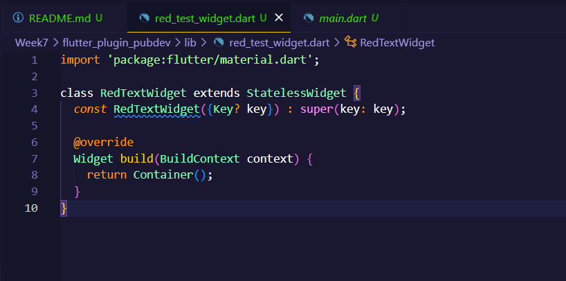
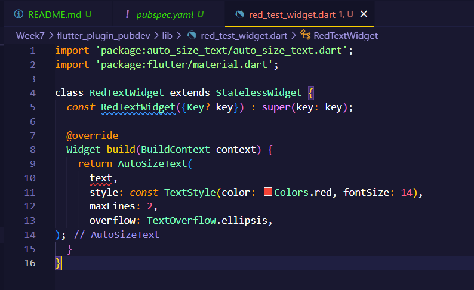
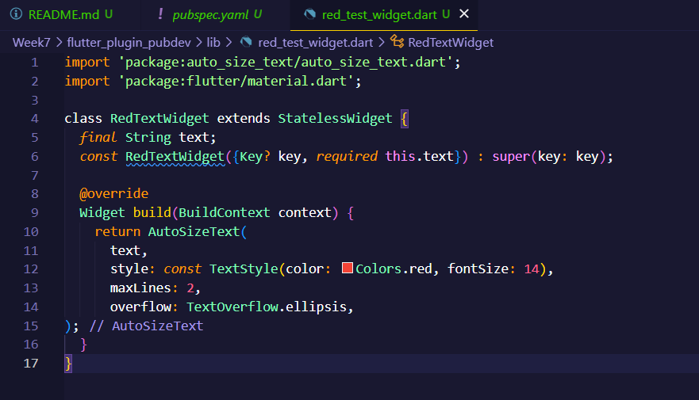
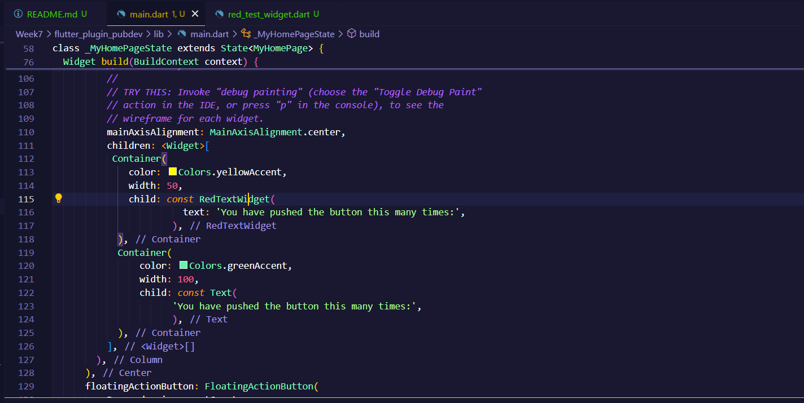
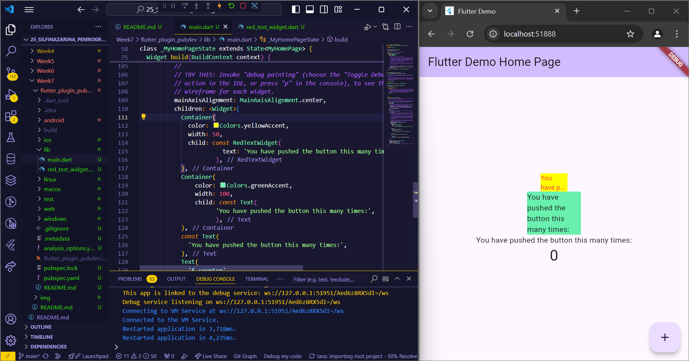
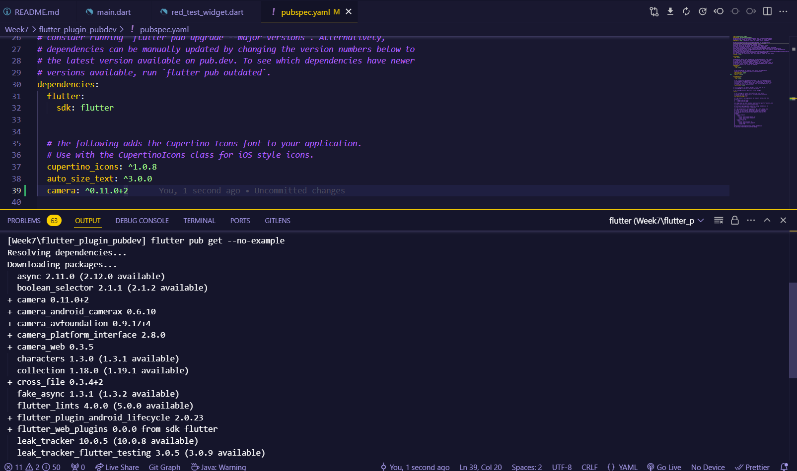
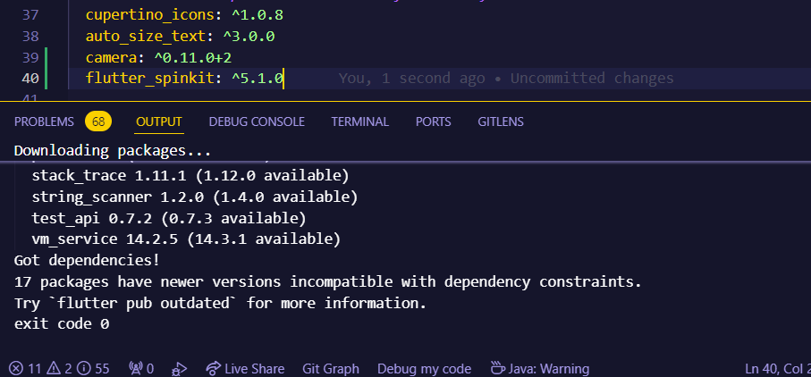

# **SILFI NAZARINA / TI-3G / 25**

# **Praktikum Menerapkan Plugin di Project Flutter**

### **Langkah 1: Buat project baru**

Buatlah sebuah project flutter baru dengan nama flutter_plugin_pubdev.



### **Langkah 2: Menambahkan Plugin**

Tambahkan plugin auto_size_text di terminal. Jika berhasil, maka akan tampil nama plugin beserta versinya di file pubspec.yaml pada bagian dependencies.



### **Langkah 3: Buat file red_text_widget.dart**

Buat file baru bernama red_text_widget.dart di dalam folder lib lalu isi kode seperti berikut.



### **Langkah 4: Tambah Widget AutoSizeText**

Masih di file red_text_widget.dart, untuk menggunakan plugin auto_size_text, ubahlah kode return Container() menjadi seperti berikut.



Terjadi error pada variabel text, karena sebelumnya variabel teks belum dideklarasikan.

### **Langkah 5: Buat Variabel text dan parameter di constructor**

Tambahkan variabel text dan parameter di constructor seperti berikut.



### **Langkah 6: Tambahkan widget di main.dart**

Buka file main.dart lalu tambahkan di dalam children: pada class _MyHomePageState



Run aplikasi tersebut dengan tekan F5, output:




## **Tugas Praktikum**

1. Selesaikan Praktikum tersebut, lalu dokumentasikan dan push ke repository Anda berupa screenshot hasil pekerjaan beserta penjelasannya di file README.md!

    **Jawab**: Hasil praktikum sudah laporkan pada langkah [praktikum](#praktikum-menerapkan-plugin-di-project-flutter)! diatas 

2. Jelaskan maksud dari langkah 2 pada praktikum tersebut!

    **Jawab**: Langkah ini bertujuan untuk menambahkan plugin **auto_size_text** ke proyek Flutter. Plugin ini berfungsi untuk menyesuaikan ukuran teks secara otomatis sehingga sesuai dengan ruang yang tersedia di layar, tanpa harus memotong teks atau mengatur ukuran teks secara manual. Dengan menjalankan perintah `flutter pub add auto_size_text` di terminal, plugin tersebut akan ditambahkan ke bagian dependencies di file `pubspec.yaml`.

3. Jelaskan maksud dari langkah 5 pada praktikum tersebut!

    **Jawab**: Langkah ini bertujuan untuk membuat variabel text dan mendefinisikan parameter pada constructor di dalam sebuah widget khusus, yaitu RedTextWidget. Variabel text bertipe String akan menyimpan data teks yang akan ditampilkan oleh widget.

    Pada constructor RedTextWidget, ditambahkan parameter required this.text, yang menandakan bahwa saat widget ini digunakan, nilai text harus diberikan. Hal ini memastikan bahwa teks yang akan ditampilkan oleh widget RedTextWidget selalu ada saat widget tersebut dibuat. Selain itu, penggunaan super(key: key) memungkinkan pengelolaan kunci (key) untuk identifikasi widget dalam hirarki widget pada Flutter.

4. Pada langkah 6 terdapat dua widget yang ditambahkan, jelaskan fungsi dan perbedaannya!

    Jawab: 
    
    - Container Pertama (RedTextWidget): Menampilkan teks dari custom widget RedTextWidget dengan latar belakang kuning dan lebar 50 piksel.

    - Container Kedua (Text): Menampilkan teks menggunakan widget Text bawaan Flutter dengan latar belakang hijau dan lebar 100 piksel.

    Perbedaan antara keduanya dapat dilihat dari beberapa aspek antara lain:

    - Widget Teks: Container pertama menggunakan RedTextWidget, sebuah widget custom yang kemungkinan memiliki tampilan atau fungsionalitas khusus, sedangkan container kedua menggunakan widget bawaan Text dari Flutter, yang menampilkan teks dengan perilaku standar.

    - Lebar Container: Container pertama memiliki lebar lebih kecil (50 piksel), sehingga teks mungkin lebih cepat terpotong, sementara container kedua lebih lebar (100 piksel), memberikan lebih banyak ruang untuk teks tampil lebih lengkap.

    - Latar Belakang: Container pertama memiliki latar belakang kuning, sedangkan yang kedua hijau, yang memberikan perbedaan visual tetapi tidak memengaruhi fungsi teks.

5. Jelaskan maksud dari tiap parameter yang ada di dalam plugin auto_size_text berdasarkan tautan pada dokumentasi ini !

    Jawab: Berikut adalah penjelasan mengenai parameter yang ada dalam plugin auto_size_text:

    - key: Kunci untuk menggantikan widget lain dalam pohon widget.
    - textKey: Kunci untuk widget Text yang dihasilkan.
    - style: Gaya teks yang digunakan.
    - minFontSize: Ukuran font minimum saat penyesuaian ukuran teks, diabaikan jika presetFontSizes diatur.
    - maxFontSize: Ukuran font maksimum untuk penyesuaian ukuran teks, diabaikan jika presetFontSizes diatur.
    - stepGranularity: Langkah pengurangan ukuran font saat menyesuaikan ukuran.
    - presetFontSizes: Daftar ukuran font yang diperbolehkan, harus dalam urutan menurun.
    - group: Mengelompokkan beberapa AutoSizeText agar memiliki ukuran yang sama.
    - textAlign: Pengaturan perataan teks secara horizontal.
    - textDirection: Arah teks yang menentukan interpretasi nilai perataan.
    - locale: Memilih font yang tepat berdasarkan karakter Unicode.
    - softWrap: Menentukan apakah teks dapat dipotong pada pemisah baris.
    - wrapWords: Menentukan apakah kata yang tidak muat akan dibungkus.
    - overflow: Menentukan bagaimana menangani overflow visual.
    - overflowReplacement: Widget yang ditampilkan jika teks tidak muat.
    - textScaleFactor: Faktor skala font untuk mempengaruhi ukuran font.
    - maxLines: Jumlah maksimum baris untuk teks.
    - semanticsLabel: Label alternatif untuk aksesibilitas.


## **Tugas Add Plugin Kamera**

Tambahkan plugin untuk fungsi kamera pada aplikasi. Misalnya menggunakan plugin ini https://pub.dev/packages/camera (silakan boleh gunakan plugin lain).

- tambah dependency di pubspec.yaml:

    

- menambah file camera_page.dart untuk menambah halaman baru untuk menampilkan deteksi oleh camera

```dart
import 'package:camera/camera.dart';
import 'package:flutter/material.dart';

class CameraPage extends StatefulWidget {
  @override
  _CameraPageState createState() => _CameraPageState();
}

class _CameraPageState extends State<CameraPage> {
  CameraController? _cameraController;
  List<CameraDescription>? cameras;

  @override
  void initState() {
    super.initState();
    _initializeCamera();
  }

  Future<void> _initializeCamera() async {
    cameras = await availableCameras();
    _cameraController = CameraController(cameras![0], ResolutionPreset.high);
    await _cameraController?.initialize();
    setState(() {});
  }

  @override
  Widget build(BuildContext context) {
    if (_cameraController == null || !_cameraController!.value.isInitialized) {
      return Center(child: CircularProgressIndicator());
    }

    return Scaffold(
      appBar: AppBar(title: Text('Camera')),
      body: CameraPreview(_cameraController!),
    );
  }

  @override
  void dispose() {
    _cameraController?.dispose();
    super.dispose();
  }
}
```

- menambahkan fungsi berpindah halaman dari main ke halaman camera

```dart
<!-- import class cameranya -->
import 'package:flutter_plugin_pubdev/camera_page.dart';

...

<!-- Fungsinya -->
void _openCamera() {
    Navigator.of(context).push(
      MaterialPageRoute(builder: (context) => CameraPage()), // Pindah ke halaman CameraScreen
    );
  }

  ...

  <!-- menambahkan button buka kamera -->
  const SizedBox(height: 20),
            ElevatedButton(
                onPressed: _openCamera, // Tombol untuk membuka kamera di halaman camera_page
                child: const Text('Open Camera'),
            ),
```

Output:


## **Tugas Add Plugin Animasi Loading dan Transisi**

Tambahkan plugin animasi loading dan transisi.

- Menambahkan dependency pluginnya di pubspec.yaml



- Menambahkan kode pada main.dart 

```dart
import 'package:flutter/material.dart';
import 'package:flutter_plugin_pubdev/camera_page.dart';
import 'package:flutter_plugin_pubdev/red_test_widget.dart';
import 'package:flutter_spinkit/flutter_spinkit.dart';

void main() {
  runApp(const MyApp());
}

class MyApp extends StatelessWidget {
  const MyApp({super.key});

  // This widget is the root of your application.
  @override
  Widget build(BuildContext context) {
    return MaterialApp(
      title: 'Flutter Demo',
      theme: ThemeData(
        colorScheme: ColorScheme.fromSeed(seedColor: Colors.deepPurple),
        useMaterial3: true,
      ),
      home: const MyHomePage(title: 'Flutter Demo Home Page'),
    );
  }
}

class MyHomePage extends StatefulWidget {
  const MyHomePage({super.key, required this.title});
  final String title;

  @override
  State<MyHomePage> createState() => _MyHomePageState();
}

class _MyHomePageState extends State<MyHomePage> {
  int _counter = 0;
  bool _isLoading = false;

  void _incrementCounter() {
    setState(() {
      _counter++;
    }); 
  }

// fungsi untuk membuka halaman kamera dengan loading dan animasi transisi
  void _openCamera() async {
    setState(() {
      _isLoading = true; // Aktifkan loading saat memulai proses
    });

    setState(() {
      _isLoading = false; // Matikan loading setelah selesai
    });

    // Navigasi dengan animasi transisi ke halaman kamera
    Navigator.of(context).push(
      PageRouteBuilder(
        pageBuilder: (context, animation, secondaryAnimation) => CameraPage(),
        transitionsBuilder: (context, animation, secondaryAnimation, child) {
          const begin = Offset(0.0, 1.0); // Animasi dimulai dari bawah
          const end = Offset.zero;
          const curve = Curves.easeInOut;

          var tween = Tween(begin: begin, end: end).chain(CurveTween(curve: curve));
          var offsetAnimation = animation.drive(tween);

          return SlideTransition(
            position: offsetAnimation, // Transisi pergeseran posisi
            child: child,
          );
        },
      ),
    );
  }

  @override
  Widget build(BuildContext context) {
    return Scaffold(
      appBar: AppBar(
        backgroundColor: Theme.of(context).colorScheme.inversePrimary,
        title: Text(widget.title),
      ),
      body: Center(
        child: _isLoading
      ? const SpinKitCircle(color: Colors.blue, size: 50.0) // Animasi loading saat _isLoading true
      : Column(
          mainAxisAlignment: MainAxisAlignment.center,
          children: <Widget>[
            Container(
              color: Colors.yellowAccent,
              width: 50,
              child: const RedTextWidget(
                        text: 'You have pushed the button this many times:',
                      ),
            ),
            Container(
                color: Colors.greenAccent,
                width: 100,
                child: const Text(
                      'You have pushed the button this many times:',
                      ),
            ),
            const Text(
              'You have pushed the button this many times:',
            ),
            Text(
              '$_counter',
              style: Theme.of(context).textTheme.headlineMedium,
            ),
            const SizedBox(height: 20),
            ElevatedButton(
              onPressed: _openCamera, // Tombol untuk membuka kamera di halaman camera_page
              child: const Text('Open Camera'),
            ),
          ],
        ),
      ),
      floatingActionButton: FloatingActionButton(
        onPressed: _incrementCounter,
        tooltip: 'Increment',
        child: const Icon(Icons.add),
      ), // This trailing comma makes auto-formatting nicer for build methods.
    );
  }
}
```

Output:


Walau tidak terlalu jelas, namun ketika tidak dilakukan screen record sebelumnya, animasi saat beralih dari camera page kembali ke homenya animasi bergerak kebawah.

